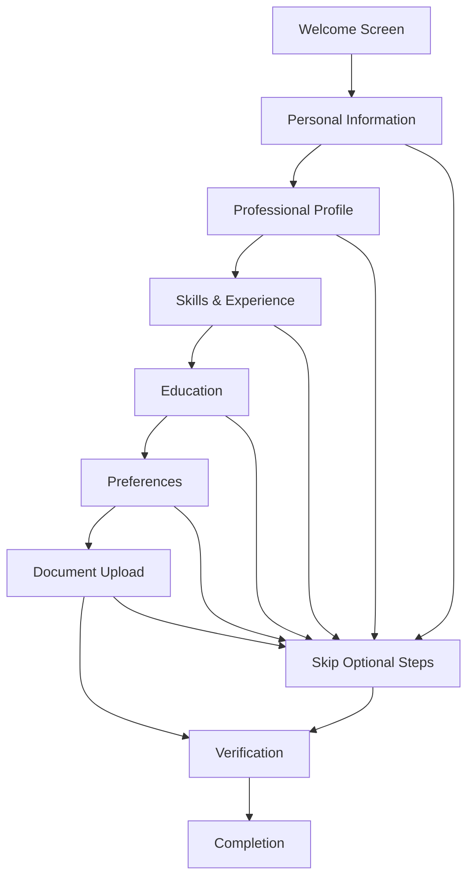

# Admin Panel & Onboarding Wizard Design
## Job Candidate Portal - Administrative Interface & User Onboarding

### Overview
This document outlines the design for the admin panel and onboarding wizard for the Job Candidate Portal. The admin panel provides comprehensive management capabilities for administrators, while the onboarding wizard ensures smooth user experience for new candidates.

### Admin Panel Architecture

#### 1. System Overview

```mermaid
graph TB
    A[Admin Panel] --> B[Dashboard]
    A --> C[User Management]
    A --> D[Job Management]
    A --> E[Application Management]
    A --> F[System Settings]
    A --> G[Analytics & Reports]
    
    B --> H[Real-time Metrics]
    B --> I[System Health]
    B --> J[Recent Activity]
    
    C --> K[User Profiles]
    C --> L[Role Management]
    C --> M[User Analytics]
    
    D --> N[Job Postings]
    D --> O[Company Management]
    D --> P[Job Categories]
    
    E --> Q[Application Review]
    E --> R[Interview Scheduling]
    E --> S[Status Management]
    
    F --> T[System Configuration]
    F --> U[Integration Settings]
    F --> V[Security Settings]
    
    G --> W[Performance Metrics]
    G --> X[User Analytics]
    G --> Y[Business Intelligence]
```


#### 2. Admin Panel Components

##### Dashboard Component
```typescript
// admin/components/Dashboard.tsx
import React, { useState, useEffect } from 'react';
import { Card, CardContent, CardHeader, CardTitle } from '@/components/ui/card';
import { Tabs, TabsContent, TabsList, TabsTrigger } from '@/components/ui/tabs';
import { MetricsCard } from './MetricsCard';
import { RecentActivity } from './RecentActivity';
import { SystemHealth } from './SystemHealth';
import { QuickActions } from './QuickActions';

interface DashboardProps {
  user: AdminUser;
}

export const Dashboard: React.FC<DashboardProps> = ({ user }) => {
  const [metrics, setMetrics] = useState<DashboardMetrics | null>(null);
  const [loading, setLoading] = useState(true);

  useEffect(() => {
    loadDashboardData();
  }, []);

  const loadDashboardData = async () => {
    try {
      const response = await fetch('/api/admin/dashboard');
      const data = await response.json();
      setMetrics(data);
    } catch (error) {
      console.error('Failed to load dashboard data:', error);
    } finally {
      setLoading(false);
    }
  };

  if (loading) {
    return <div className="flex items-center justify-center h-64">Loading...</div>;
  }

  return (
    <div className="space-y-6">
      {/* Header */}
      <div className="flex items-center justify-between">
        <div>
          <h1 className="text-3xl font-bold">Admin Dashboard</h1>
          <p className="text-gray-600">Welcome back, {user.firstName}</p>
        </div>
        <QuickActions />
      </div>

      {/* Key Metrics */}
      <div className="grid grid-cols-1 md:grid-cols-2 lg:grid-cols-4 gap-6">
        <MetricsCard
          title="Total Users"
          value={metrics?.totalUsers || 0}
          change={metrics?.userGrowth || 0}
          icon="users"
        />
        <MetricsCard
          title="Active Jobs"
          value={metrics?.activeJobs || 0}
          change={metrics?.jobGrowth || 0}
          icon="briefcase"
        />
        <MetricsCard
          title="Applications"
          value={metrics?.totalApplications || 0}
          change={metrics?.applicationGrowth || 0}
          icon="file-text"
        />
        <MetricsCard
          title="Interviews"
          value={metrics?.scheduledInterviews || 0}
          change={metrics?.interviewGrowth || 0}
          icon="calendar"
        />
      </div>

      {/* Main Content Tabs */}
      <Tabs defaultValue="overview" className="space-y-6">
        <TabsList>
          <TabsTrigger value="overview">Overview</TabsTrigger>
          <TabsTrigger value="activity">Recent Activity</TabsTrigger>
          <TabsTrigger value="health">System Health</TabsTrigger>
          <TabsTrigger value="analytics">Analytics</TabsTrigger>
        </TabsList>

        <TabsContent value="overview" className="space-y-6">
          <div className="grid grid-cols-1 lg:grid-cols-2 gap-6">
            <Card>
              <CardHeader>
                <CardTitle>User Growth</CardTitle>
              </CardHeader>
              <CardContent>
                <UserGrowthChart data={metrics?.userGrowthData} />
              </CardContent>
            </Card>

            <Card>
              <CardHeader>
                <CardTitle>Application Trends</CardTitle>
              </CardHeader>
              <CardContent>
                <ApplicationTrendsChart data={metrics?.applicationTrends} />
              </CardContent>
            </Card>
          </div>
        </TabsContent>

        <TabsContent value="activity">
          <RecentActivity activities={metrics?.recentActivities} />
        </TabsContent>

        <TabsContent value="health">
          <SystemHealth health={metrics?.systemHealth} />
        </TabsContent>

        <TabsContent value="analytics">
          <AnalyticsDashboard analytics={metrics?.analytics} />
        </TabsContent>
      </Tabs>
    </div>
  );
};
```

##### User Management Component
```typescript
// admin/components/UserManagement.tsx
import React, { useState, useEffect } from 'react';
import { Card, CardContent, CardHeader, CardTitle } from '@/components/ui/card';
import { Button } from '@/components/ui/button';
import { Input } from '@/components/ui/input';
import { Badge } from '@/components/ui/badge';
import { Avatar, AvatarFallback, AvatarImage } from '@/components/ui/avatar';
import { 
  Table, 
  TableBody, 
  TableCell, 
  TableHead, 
  TableHeader, 
  TableRow 
} from '@/components/ui/table';
import { 
  DropdownMenu, 
  DropdownMenuContent, 
  DropdownMenuItem, 
  DropdownMenuTrigger 
} from '@/components/ui/dropdown-menu';
import { MoreHorizontal, Search, Filter, Download } from 'lucide-react';

interface UserManagementProps {
  user: AdminUser;
}

export const UserManagement: React.FC<UserManagementProps> = ({ user }) => {
  const [users, setUsers] = useState<User[]>([]);
  const [loading, setLoading] = useState(true);
  const [searchTerm, setSearchTerm] = useState('');
  const [selectedRole, setSelectedRole] = useState<string>('all');
  const [selectedStatus, setSelectedStatus] = useState<string>('all');

  useEffect(() => {
    loadUsers();
  }, [searchTerm, selectedRole, selectedStatus]);

  const loadUsers = async () => {
    try {
      const params = new URLSearchParams({
        search: searchTerm,
        role: selectedRole,
        status: selectedStatus
      });

      const response = await fetch(`/api/admin/users?${params}`);
      const data = await response.json();
      setUsers(data.users);
    } catch (error) {
      console.error('Failed to load users:', error);
    } finally {
      setLoading(false);
    }
  };

  const handleRoleChange = async (userId: string, newRole: string) => {
    try {
      await fetch(`/api/admin/users/${userId}/role`, {
        method: 'PUT',
        headers: { 'Content-Type': 'application/json' },
        body: JSON.stringify({ role: newRole })
      });

      // Update local state
      setUsers(users.map(user => 
        user.id === userId ? { ...user, role: newRole } : user
      ));
    } catch (error) {
      console.error('Failed to update user role:', error);
    }
  };

  const handleStatusChange = async (userId: string, newStatus: boolean) => {
    try {
      await fetch(`/api/admin/users/${userId}/status`, {
        method: 'PUT',
        headers: { 'Content-Type': 'application/json' },
        body: JSON.stringify({ isActive: newStatus })
      });

      // Update local state
      setUsers(users.map(user => 
        user.id === userId ? { ...user, isActive: newStatus } : user
      ));
    } catch (error) {
      console.error('Failed to update user status:', error);
    }
  };

  const exportUsers = async () => {
    try {
      const response = await fetch('/api/admin/users/export');
      const blob = await response.blob();
      const url = window.URL.createObjectURL(blob);
      const a = document.createElement('a');
      a.href = url;
      a.download = 'users.csv';
      a.click();
      window.URL.revokeObjectURL(url);
    } catch (error) {
      console.error('Failed to export users:', error);
    }
  };

  return (
    <div className="space-y-6">
      {/* Header */}
      <div className="flex items-center justify-between">
        <div>
          <h1 className="text-3xl font-bold">User Management</h1>
          <p className="text-gray-600">Manage user accounts and permissions</p>
        </div>
        <Button onClick={exportUsers} variant="outline">
          <Download className="w-4 h-4 mr-2" />
          Export Users
        </Button>
      </div>

      {/* Filters */}
      <Card>
        <CardContent className="pt-6">
          <div className="flex items-center space-x-4">
            <div className="relative flex-1">
              <Search className="absolute left-3 top-1/2 transform -translate-y-1/2 text-gray-400 w-4 h-4" />
              <Input
                placeholder="Search users..."
                value={searchTerm}
                onChange={(e) => setSearchTerm(e.target.value)}
                className="pl-10"
              />
            </div>
            
            <select
              value={selectedRole}
              onChange={(e) => setSelectedRole(e.target.value)}
              className="px-3 py-2 border border-gray-300 rounded-md"
            >
              <option value="all">All Roles</option>
              <option value="candidate">Candidates</option>
              <option value="admin">Admins</option>
              <option value="super_admin">Super Admins</option>
            </select>

            <select
              value={selectedStatus}
              onChange={(e) => setSelectedStatus(e.target.value)}
              className="px-3 py-2 border border-gray-300 rounded-md"
            >
              <option value="all">All Status</option>
              <option value="active">Active</option>
              <option value="inactive">Inactive</option>
            </select>
          </div>
        </CardContent>
      </Card>

      {/* Users Table */}
      <Card>
        <CardHeader>
          <CardTitle>Users ({users.length})</CardTitle>
        </CardHeader>
        <CardContent>
          <Table>
            <TableHeader>
              <TableRow>
                <TableHead>User</TableHead>
                <TableHead>Email</TableHead>
                <TableHead>Role</TableHead>
                <TableHead>Status</TableHead>
                <TableHead>Last Login</TableHead>
                <TableHead>Created</TableHead>
                <TableHead className="w-[50px]"></TableHead>
              </TableRow>
            </TableHeader>
            <TableBody>
              {users.map((user) => (
                <TableRow key={user.id}>
                  <TableCell>
                    <div className="flex items-center space-x-3">
                      <Avatar>
                        <AvatarImage src={user.avatarUrl} />
                        <AvatarFallback>
                          {user.firstName[0]}{user.lastName[0]}
                        </AvatarFallback>
                      </Avatar>
                      <div>
                        <div className="font-medium">
                          {user.firstName} {user.lastName}
                        </div>
                        <div className="text-sm text-gray-500">
                          {user.location}
                        </div>
                      </div>
                    </div>
                  </TableCell>
                  <TableCell>{user.email}</TableCell>
                  <TableCell>
                    <Badge variant={user.role === 'admin' ? 'default' : 'secondary'}>
                      {user.role}
                    </Badge>
                  </TableCell>
                  <TableCell>
                    <Badge variant={user.isActive ? 'default' : 'destructive'}>
                      {user.isActive ? 'Active' : 'Inactive'}
                    </Badge>
                  </TableCell>
                  <TableCell>
                    {user.lastLoginAt ? new Date(user.lastLoginAt).toLocaleDateString() : 'Never'}
                  </TableCell>
                  <TableCell>
                    {new Date(user.createdAt).toLocaleDateString()}
                  </TableCell>
                  <TableCell>
                    <DropdownMenu>
                      <DropdownMenuTrigger asChild>
                        <Button variant="ghost" size="sm">
                          <MoreHorizontal className="w-4 h-4" />
                        </Button>
                      </DropdownMenuTrigger>
                      <DropdownMenuContent align="end">
                        <DropdownMenuItem onClick={() => handleRoleChange(user.id, 'admin')}>
                          Make Admin
                        </DropdownMenuItem>
                        <DropdownMenuItem onClick={() => handleRoleChange(user.id, 'candidate')}>
                          Make Candidate
                        </DropdownMenuItem>
                        <DropdownMenuItem onClick={() => handleStatusChange(user.id, !user.isActive)}>
                          {user.isActive ? 'Deactivate' : 'Activate'}
                        </DropdownMenuItem>
                      </DropdownMenuContent>
                    </DropdownMenu>
                  </TableCell>
                </TableRow>
              ))}
            </TableBody>
          </Table>
        </CardContent>
      </Card>
    </div>
  );
};
```

##### Job Management Component
```typescript
// admin/components/JobManagement.tsx
import React, { useState, useEffect } from 'react';
import { Card, CardContent, CardHeader, CardTitle } from '@/components/ui/card';
import { Button } from '@/components/ui/button';
import { Input } from '@/components/ui/input';
import { Badge } from '@/components/ui/badge';
import { 
  Table, 
  TableBody, 
  TableCell, 
  TableHead, 
  TableHeader, 
  TableRow 
} from '@/components/ui/table';
import { 
  DropdownMenu, 
  DropdownMenuContent, 
  DropdownMenuItem, 
  DropdownMenuTrigger 
} from '@/components/ui/dropdown-menu';
import { MoreHorizontal, Search, Plus, Sync } from 'lucide-react';

interface JobManagementProps {
  user: AdminUser;
}

export const JobManagement: React.FC<JobManagementProps> = ({ user }) => {
  const [jobs, setJobs] = useState<Job[]>([]);
  const [loading, setLoading] = useState(true);
  const [searchTerm, setSearchTerm] = useState('');
  const [selectedStatus, setSelectedStatus] = useState<string>('all');

  useEffect(() => {
    loadJobs();
  }, [searchTerm, selectedStatus]);

  const loadJobs = async () => {
    try {
      const params = new URLSearchParams({
        search: searchTerm,
        status: selectedStatus
      });

      const response = await fetch(`/api/admin/jobs?${params}`);
      const data = await response.json();
      setJobs(data.jobs);
    } catch (error) {
      console.error('Failed to load jobs:', error);
    } finally {
      setLoading(false);
    }
  };

  const syncJobsFromFrappe = async () => {
    try {
      setLoading(true);
      const response = await fetch('/api/admin/jobs/sync', {
        method: 'POST'
      });
      const result = await response.json();
      
      if (result.success) {
        await loadJobs();
        alert(`Synced ${result.synced} jobs successfully`);
      } else {
        alert(`Sync failed: ${result.error}`);
      }
    } catch (error) {
      console.error('Failed to sync jobs:', error);
      alert('Sync failed');
    } finally {
      setLoading(false);
    }
  };

  const handleJobStatusChange = async (jobId: string, newStatus: string) => {
    try {
      await fetch(`/api/admin/jobs/${jobId}/status`, {
        method: 'PUT',
        headers: { 'Content-Type': 'application/json' },
        body: JSON.stringify({ status: newStatus })
      });

      setJobs(jobs.map(job => 
        job.id === jobId ? { ...job, status: newStatus } : job
      ));
    } catch (error) {
      console.error('Failed to update job status:', error);
    }
  };

  return (
    <div className="space-y-6">
      {/* Header */}
      <div className="flex items-center justify-between">
        <div>
          <h1 className="text-3xl font-bold">Job Management</h1>
          <p className="text-gray-600">Manage job postings and company information</p>
        </div>
        <div className="flex items-center space-x-2">
          <Button onClick={syncJobsFromFrappe} variant="outline">
            <Sync className="w-4 h-4 mr-2" />
            Sync from Frappe
          </Button>
          <Button>
            <Plus className="w-4 h-4 mr-2" />
            Add Job
          </Button>
        </div>
      </div>

      {/* Filters */}
      <Card>
        <CardContent className="pt-6">
          <div className="flex items-center space-x-4">
            <div className="relative flex-1">
              <Search className="absolute left-3 top-1/2 transform -translate-y-1/2 text-gray-400 w-4 h-4" />
              <Input
                placeholder="Search jobs..."
                value={searchTerm}
                onChange={(e) => setSearchTerm(e.target.value)}
                className="pl-10"
              />
            </div>
            
            <select
              value={selectedStatus}
              onChange={(e) => setSelectedStatus(e.target.value)}
              className="px-3 py-2 border border-gray-300 rounded-md"
            >
              <option value="all">All Status</option>
              <option value="active">Active</option>
              <option value="inactive">Inactive</option>
              <option value="draft">Draft</option>
              <option value="closed">Closed</option>
            </select>
          </div>
        </CardContent>
      </Card>

      {/* Jobs Table */}
      <Card>
        <CardHeader>
          <CardTitle>Jobs ({jobs.length})</CardTitle>
        </CardHeader>
        <CardContent>
          <Table>
            <TableHeader>
              <TableRow>
                <TableHead>Job Title</TableHead>
                <TableHead>Company</TableHead>
                <TableHead>Location</TableHead>
                <TableHead>Status</TableHead>
                <TableHead>Applications</TableHead>
                <TableHead>Posted</TableHead>
                <TableHead className="w-[50px]"></TableHead>
              </TableRow>
            </TableHeader>
            <TableBody>
              {jobs.map((job) => (
                <TableRow key={job.id}>
                  <TableCell>
                    <div>
                      <div className="font-medium">{job.title}</div>
                      <div className="text-sm text-gray-500">{job.department}</div>
                    </div>
                  </TableCell>
                  <TableCell>{job.company.name}</TableCell>
                  <TableCell>{job.location}</TableCell>
                  <TableCell>
                    <Badge variant={job.status === 'active' ? 'default' : 'secondary'}>
                      {job.status}
                    </Badge>
                  </TableCell>
                  <TableCell>{job.applicationCount || 0}</TableCell>
                  <TableCell>
                    {job.postedAt ? new Date(job.postedAt).toLocaleDateString() : 'N/A'}
                  </TableCell>
                  <TableCell>
                    <DropdownMenu>
                      <DropdownMenuTrigger asChild>
                        <Button variant="ghost" size="sm">
                          <MoreHorizontal className="w-4 h-4" />
                        </Button>
                      </DropdownMenuTrigger>
                      <DropdownMenuContent align="end">
                        <DropdownMenuItem onClick={() => handleJobStatusChange(job.id, 'active')}>
                          Activate
                        </DropdownMenuItem>
                        <DropdownMenuItem onClick={() => handleJobStatusChange(job.id, 'inactive')}>
                          Deactivate
                        </DropdownMenuItem>
                        <DropdownMenuItem onClick={() => handleJobStatusChange(job.id, 'closed')}>
                          Close
                        </DropdownMenuItem>
                      </DropdownMenuContent>
                    </DropdownMenu>
                  </TableCell>
                </TableRow>
              ))}
            </TableBody>
          </Table>
        </CardContent>
      </Card>
    </div>
  );
};
```

### Onboarding Wizard Design

#### 1. Onboarding Flow


#### 2. Onboarding Wizard Component
```typescript
// onboarding/OnboardingWizard.tsx
import React, { useState, useEffect } from 'react';
import { Card, CardContent, CardHeader, CardTitle } from '@/components/ui/card';
import { Button } from '@/components/ui/button';
import { Progress } from '@/components/ui/progress';
import { PersonalInfoStep } from './steps/PersonalInfoStep';
import { ProfessionalProfileStep } from './steps/ProfessionalProfileStep';
import { SkillsExperienceStep } from './steps/SkillsExperienceStep';
import { EducationStep } from './steps/EducationStep';
import { PreferencesStep } from './steps/PreferencesStep';
import { DocumentUploadStep } from './steps/DocumentUploadStep';
import { VerificationStep } from './steps/VerificationStep';
import { CompletionStep } from './steps/CompletionStep';

interface OnboardingWizardProps {
  user: User;
  onComplete: () => void;
}

export const OnboardingWizard: React.FC<OnboardingWizardProps> = ({ user, onComplete }) => {
  const [currentStep, setCurrentStep] = useState(0);
  const [completedSteps, setCompletedSteps] = useState<number[]>([]);
  const [formData, setFormData] = useState<OnboardingData>({});
  const [loading, setLoading] = useState(false);

  const steps = [
    { id: 'personal', title: 'Personal Information', component: PersonalInfoStep },
    { id: 'professional', title: 'Professional Profile', component: ProfessionalProfileStep },
    { id: 'skills', title: 'Skills & Experience', component: SkillsExperienceStep },
    { id: 'education', title: 'Education', component: EducationStep },
    { id: 'preferences', title: 'Preferences', component: PreferencesStep },
    { id: 'documents', title: 'Documents', component: DocumentUploadStep },
    { id: 'verification', title: 'Verification', component: VerificationStep },
    { id: 'completion', title: 'Complete', component: CompletionStep }
  ];

  const progress = ((currentStep + 1) / steps.length) * 100;

  const handleNext = async (stepData: any) => {
    try {
      setLoading(true);
      
      // Update form data
      setFormData(prev => ({ ...prev, ...stepData }));
      
      // Mark step as completed
      setCompletedSteps(prev => [...prev, currentStep]);
      
      // Save step data to backend
      await saveStepData(steps[currentStep].id, stepData);
      
      // Move to next step
      if (currentStep < steps.length - 1) {
        setCurrentStep(prev => prev + 1);
      } else {
        // Complete onboarding
        await completeOnboarding();
        onComplete();
      }
    } catch (error) {
      console.error('Failed to save step data:', error);
    } finally {
      setLoading(false);
    }
  };

  const handlePrevious = () => {
    if (currentStep > 0) {
      setCurrentStep(prev => prev - 1);
    }
  };

  const handleSkip = () => {
    if (currentStep < steps.length - 1) {
      setCurrentStep(prev => prev + 1);
    }
  };

  const saveStepData = async (stepId: string, data: any) => {
    const response = await fetch('/api/onboarding/save-step', {
      method: 'POST',
      headers: { 'Content-Type': 'application/json' },
      body: JSON.stringify({ stepId, data })
    });

    if (!response.ok) {
      throw new Error('Failed to save step data');
    }
  };

  const completeOnboarding = async () => {
    const response = await fetch('/api/onboarding/complete', {
      method: 'POST',
      headers: { 'Content-Type': 'application/json' },
      body: JSON.stringify(formData)
    });

    if (!response.ok) {
      throw new Error('Failed to complete onboarding');
    }
  };

  const CurrentStepComponent = steps[currentStep].component;

  return (
    <div className="min-h-screen bg-gray-50 py-8">
      <div className="max-w-4xl mx-auto px-4">
        {/* Header */}
        <div className="text-center mb-8">
          <h1 className="text-3xl font-bold text-gray-900">Welcome to the Job Portal</h1>
          <p className="text-gray-600 mt-2">
            Let's set up your profile to get started
          </p>
        </div>

        {/* Progress */}
        <div className="mb-8">
          <div className="flex items-center justify-between mb-2">
            <span className="text-sm font-medium text-gray-700">
              Step {currentStep + 1} of {steps.length}
            </span>
            <span className="text-sm text-gray-500">
              {Math.round(progress)}% complete
            </span>
          </div>
          <Progress value={progress} className="h-2" />
        </div>

        {/* Step Navigation */}
        <div className="flex items-center justify-center mb-8">
          <div className="flex items-center space-x-4">
            {steps.map((step, index) => (
              <div
                key={step.id}
                className={`flex items-center ${
                  index <= currentStep ? 'text-blue-600' : 'text-gray-400'
                }`}
              >
                <div
                  className={`w-8 h-8 rounded-full flex items-center justify-center text-sm font-medium ${
                    index < currentStep
                      ? 'bg-blue-600 text-white'
                      : index === currentStep
                      ? 'bg-blue-100 text-blue-600'
                      : 'bg-gray-200 text-gray-400'
                  }`}
                >
                  {index < currentStep ? '✓' : index + 1}
                </div>
                <span className="ml-2 text-sm font-medium">{step.title}</span>
                {index < steps.length - 1 && (
                  <div className="w-8 h-px bg-gray-300 mx-4" />
                )}
              </div>
            ))}
          </div>
        </div>

        {/* Step Content */}
        <Card>
          <CardHeader>
            <CardTitle>{steps[currentStep].title}</CardTitle>
          </CardHeader>
          <CardContent>
            <CurrentStepComponent
              data={formData}
              onNext={handleNext}
              onPrevious={handlePrevious}
              onSkip={handleSkip}
              loading={loading}
              isFirstStep={currentStep === 0}
              isLastStep={currentStep === steps.length - 1}
            />
          </CardContent>
        </Card>
      </div>
    </div>
  );
};
```

#### 3. Individual Step Components

##### Personal Information Step
```typescript
// onboarding/steps/PersonalInfoStep.tsx
import React, { useState } from 'react';
import { Button } from '@/components/ui/button';
import { Input } from '@/components/ui/input';
import { Label } from '@/components/ui/label';
import { Textarea } from '@/components/ui/textarea';

interface PersonalInfoStepProps {
  data: any;
  onNext: (data: any) => void;
  onPrevious: () => void;
  onSkip: () => void;
  loading: boolean;
  isFirstStep: boolean;
  isLastStep: boolean;
}

export const PersonalInfoStep: React.FC<PersonalInfoStepProps> = ({
  data,
  onNext,
  onPrevious,
  onSkip,
  loading,
  isFirstStep,
  isLastStep
}) => {
  const [formData, setFormData] = useState({
    firstName: data.firstName || '',
    lastName: data.lastName || '',
    phone: data.phone || '',
    location: data.location || '',
    bio: data.bio || ''
  });

  const handleSubmit = (e: React.FormEvent) => {
    e.preventDefault();
    onNext(formData);
  };

  return (
    <form onSubmit={handleSubmit} className="space-y-6">
      <div className="grid grid-cols-1 md:grid-cols-2 gap-6">
        <div>
          <Label htmlFor="firstName">First Name *</Label>
          <Input
            id="firstName"
            value={formData.firstName}
            onChange={(e) => setFormData(prev => ({ ...prev, firstName: e.target.value }))}
            required
          />
        </div>
        <div>
          <Label htmlFor="lastName">Last Name *</Label>
          <Input
            id="lastName"
            value={formData.lastName}
            onChange={(e) => setFormData(prev => ({ ...prev, lastName: e.target.value }))}
            required
          />
        </div>
      </div>

      <div>
        <Label htmlFor="phone">Phone Number</Label>
        <Input
          id="phone"
          type="tel"
          value={formData.phone}
          onChange={(e) => setFormData(prev => ({ ...prev, phone: e.target.value }))}
        />
      </div>

      <div>
        <Label htmlFor="location">Location</Label>
        <Input
          id="location"
          value={formData.location}
          onChange={(e) => setFormData(prev => ({ ...prev, location: e.target.value }))}
        />
      </div>

      <div>
        <Label htmlFor="bio">Bio</Label>
        <Textarea
          id="bio"
          value={formData.bio}
          onChange={(e) => setFormData(prev => ({ ...prev, bio: e.target.value }))}
          placeholder="Tell us about yourself..."
          rows={4}
        />
      </div>

      <div className="flex items-center justify-between">
        <div className="flex items-center space-x-2">
          {!isFirstStep && (
            <Button type="button" variant="outline" onClick={onPrevious}>
              Previous
            </Button>
          )}
          <Button type="button" variant="ghost" onClick={onSkip}>
            Skip
          </Button>
        </div>
        <Button type="submit" disabled={loading}>
          {isLastStep ? 'Complete' : 'Next'}
        </Button>
      </div>
    </form>
  );
};
```

##### Skills & Experience Step
```typescript
// onboarding/steps/SkillsExperienceStep.tsx
import React, { useState } from 'react';
import { Button } from '@/components/ui/button';
import { Input } from '@/components/ui/input';
import { Label } from '@/components/ui/label';
import { Textarea } from '@/components/ui/textarea';
import { Badge } from '@/components/ui/badge';
import { Plus, X } from 'lucide-react';

interface SkillsExperienceStepProps {
  data: any;
  onNext: (data: any) => void;
  onPrevious: () => void;
  onSkip: () => void;
  loading: boolean;
  isFirstStep: boolean;
  isLastStep: boolean;
}

export const SkillsExperienceStep: React.FC<SkillsExperienceStepProps> = ({
  data,
  onNext,
  onPrevious,
  onSkip,
  loading,
  isFirstStep,
  isLastStep
}) => {
  const [skills, setSkills] = useState<string[]>(data.skills || []);
  const [newSkill, setNewSkill] = useState('');
  const [experiences, setExperiences] = useState(data.experiences || []);

  const addSkill = () => {
    if (newSkill.trim() && !skills.includes(newSkill.trim())) {
      setSkills(prev => [...prev, newSkill.trim()]);
      setNewSkill('');
    }
  };

  const removeSkill = (skillToRemove: string) => {
    setSkills(prev => prev.filter(skill => skill !== skillToRemove));
  };

  const addExperience = () => {
    setExperiences(prev => [...prev, {
      company: '',
      position: '',
      startDate: '',
      endDate: '',
      description: '',
      isCurrent: false
    }]);
  };

  const updateExperience = (index: number, field: string, value: any) => {
    setExperiences(prev => prev.map((exp, i) => 
      i === index ? { ...exp, [field]: value } : exp
    ));
  };

  const removeExperience = (index: number) => {
    setExperiences(prev => prev.filter((_, i) => i !== index));
  };

  const handleSubmit = (e: React.FormEvent) => {
    e.preventDefault();
    onNext({ skills, experiences });
  };

  return (
    <form onSubmit={handleSubmit} className="space-y-6">
      {/* Skills Section */}
      <div>
        <Label>Skills</Label>
        <div className="flex items-center space-x-2 mt-2">
          <Input
            value={newSkill}
            onChange={(e) => setNewSkill(e.target.value)}
            placeholder="Add a skill..."
            onKeyPress={(e) => e.key === 'Enter' && (e.preventDefault(), addSkill())}
          />
          <Button type="button" onClick={addSkill} size="sm">
            <Plus className="w-4 h-4" />
          </Button>
        </div>
        <div className="flex flex-wrap gap-2 mt-2">
          {skills.map((skill) => (
            <Badge key={skill} variant="secondary" className="flex items-center gap-1">
              {skill}
              <X 
                className="w-3 h-3 cursor-pointer" 
                onClick={() => removeSkill(skill)}
              />
            </Badge>
          ))}
        </div>
      </div>

      {/* Experience Section */}
      <div>
        <div className="flex items-center justify-between mb-4">
          <Label>Work Experience</Label>
          <Button type="button" onClick={addExperience} size="sm">
            <Plus className="w-4 h-4 mr-2" />
            Add Experience
          </Button>
        </div>

        <div className="space-y-4">
          {experiences.map((exp, index) => (
            <div key={index} className="border rounded-lg p-4 space-y-4">
              <div className="flex items-center justify-between">
                <h4 className="font-medium">Experience {index + 1}</h4>
                <Button 
                  type="button" 
                  variant="ghost" 
                  size="sm"
                  onClick={() => removeExperience(index)}
                >
                  <X className="w-4 h-4" />
                </Button>
              </div>

              <div className="grid grid-cols-1 md:grid-cols-2 gap-4">
                <div>
                  <Label>Company *</Label>
                  <Input
                    value={exp.company}
                    onChange={(e) => updateExperience(index, 'company', e.target.value)}
                    required
                  />
                </div>
                <div>
                  <Label>Position *</Label>
                  <Input
                    value={exp.position}
                    onChange={(e) => updateExperience(index, 'position', e.target.value)}
                    required
                  />
                </div>
                <div>
                  <Label>Start Date *</Label>
                  <Input
                    type="date"
                    value={exp.startDate}
                    onChange={(e) => updateExperience(index, 'startDate', e.target.value)}
                    required
                  />
                </div>
                <div>
                  <Label>End Date</Label>
                  <Input
                    type="date"
                    value={exp.endDate}
                    onChange={(e) => updateExperience(index, 'endDate', e.target.value)}
                    disabled={exp.isCurrent}
                  />
                </div>
              </div>

              <div className="flex items-center space-x-2">
                <input
                  type="checkbox"
                  id={`current-${index}`}
                  checked={exp.isCurrent}
                  onChange={(e) => updateExperience(index, 'isCurrent', e.target.checked)}
                />
                <Label htmlFor={`current-${index}`}>Currently working here</Label>
              </div>

              <div>
                <Label>Description</Label>
                <Textarea
                  value={exp.description}
                  onChange={(e) => updateExperience(index, 'description', e.target.value)}
                  placeholder="Describe your role and achievements..."
                  rows={3}
                />
              </div>
            </div>
          ))}
        </div>
      </div>

      <div className="flex items-center justify-between">
        <div className="flex items-center space-x-2">
          {!isFirstStep && (
            <Button type="button" variant="outline" onClick={onPrevious}>
              Previous
            </Button>
          )}
          <Button type="button" variant="ghost" onClick={onSkip}>
            Skip
          </Button>
        </div>
        <Button type="submit" disabled={loading}>
          {isLastStep ? 'Complete' : 'Next'}
        </Button>
      </div>
    </form>
  );
};
```

### System Settings & Configuration

#### 1. System Settings Component
```typescript
// admin/components/SystemSettings.tsx
import React, { useState, useEffect } from 'react';
import { Card, CardContent, CardHeader, CardTitle } from '@/components/ui/card';
import { Button } from '@/components/ui/button';
import { Input } from '@/components/ui/input';
import { Label } from '@/components/ui/label';
import { Switch } from '@/components/ui/switch';
import { Tabs, TabsContent, TabsList, TabsTrigger } from '@/components/ui/tabs';

interface SystemSettingsProps {
  user: AdminUser;
}

export const SystemSettings: React.FC<SystemSettingsProps> = ({ user }) => {
  const [settings, setSettings] = useState<SystemSettings>({});
  const [loading, setLoading] = useState(true);
  const [saving, setSaving] = useState(false);

  useEffect(() => {
    loadSettings();
  }, []);

  const loadSettings = async () => {
    try {
      const response = await fetch('/api/admin/settings');
      const data = await response.json();
      setSettings(data);
    } catch (error) {
      console.error('Failed to load settings:', error);
    } finally {
      setLoading(false);
    }
  };

  const saveSettings = async (newSettings: any) => {
    try {
      setSaving(true);
      const response = await fetch('/api/admin/settings', {
        method: 'PUT',
        headers: { 'Content-Type': 'application/json' },
        body: JSON.stringify(newSettings)
      });

      if (!response.ok) {
        throw new Error('Failed to save settings');
      }

      setSettings(newSettings);
    } catch (error) {
      console.error('Failed to save settings:', error);
    } finally {
      setSaving(false);
    }
  };

  const handleSettingChange = (key: string, value: any) => {
    const newSettings = { ...settings, [key]: value };
    setSettings(newSettings);
    saveSettings(newSettings);
  };

  if (loading) {
    return <div className="flex items-center justify-center h-64">Loading...</div>;
  }

  return (
    <div className="space-y-6">
      <div>
        <h1 className="text-3xl font-bold">System Settings</h1>
        <p className="text-gray-600">Configure system-wide settings and preferences</p>
      </div>

      <Tabs defaultValue="general" className="space-y-6">
        <TabsList>
          <TabsTrigger value="general">General</TabsTrigger>
          <TabsTrigger value="integrations">Integrations</TabsTrigger>
          <TabsTrigger value="security">Security</TabsTrigger>
          <TabsTrigger value="notifications">Notifications</TabsTrigger>
        </TabsList>

        <TabsContent value="general" className="space-y-6">
          <Card>
            <CardHeader>
              <CardTitle>General Settings</CardTitle>
            </CardHeader>
            <CardContent className="space-y-6">
              <div>
                <Label htmlFor="siteName">Site Name</Label>
                <Input
                  id="siteName"
                  value={settings.siteName || ''}
                  onChange={(e) => handleSettingChange('siteName', e.target.value)}
                />
              </div>

              <div>
                <Label htmlFor="siteDescription">Site Description</Label>
                <Input
                  id="siteDescription"
                  value={settings.siteDescription || ''}
                  onChange={(e) => handleSettingChange('siteDescription', e.target.value)}
                />
              </div>

              <div>
                <Label htmlFor="contactEmail">Contact Email</Label>
                <Input
                  id="contactEmail"
                  type="email"
                  value={settings.contactEmail || ''}
                  onChange={(e) => handleSettingChange('contactEmail', e.target.value)}
                />
              </div>

              <div className="flex items-center space-x-2">
                <Switch
                  id="maintenanceMode"
                  checked={settings.maintenanceMode || false}
                  onCheckedChange={(checked) => handleSettingChange('maintenanceMode', checked)}
                />
                <Label htmlFor="maintenanceMode">Maintenance Mode</Label>
              </div>
            </CardContent>
          </Card>
        </TabsContent>

        <TabsContent value="integrations" className="space-y-6">
          <Card>
            <CardHeader>
              <CardTitle>Frappe ERPNext Integration</CardTitle>
            </CardHeader>
            <CardContent className="space-y-6">
              <div>
                <Label htmlFor="frappeUrl">Frappe URL</Label>
                <Input
                  id="frappeUrl"
                  value={settings.frappeUrl || ''}
                  onChange={(e) => handleSettingChange('frappeUrl', e.target.value)}
                />
              </div>

              <div>
                <Label htmlFor="frappeApiKey">API Key</Label>
                <Input
                  id="frappeApiKey"
                  type="password"
                  value={settings.frappeApiKey || ''}
                  onChange={(e) => handleSettingChange('frappeApiKey', e.target.value)}
                />
              </div>

              <div className="flex items-center space-x-2">
                <Switch
                  id="frappeSyncEnabled"
                  checked={settings.frappeSyncEnabled || false}
                  onCheckedChange={(checked) => handleSettingChange('frappeSyncEnabled', checked)}
                />
                <Label htmlFor="frappeSyncEnabled">Enable Automatic Sync</Label>
              </div>
            </CardContent>
          </Card>
        </TabsContent>

        <TabsContent value="security" className="space-y-6">
          <Card>
            <CardHeader>
              <CardTitle>Security Settings</CardTitle>
            </CardHeader>
            <CardContent className="space-y-6">
              <div>
                <Label htmlFor="sessionTimeout">Session Timeout (minutes)</Label>
                <Input
                  id="sessionTimeout"
                  type="number"
                  value={settings.sessionTimeout || 60}
                  onChange={(e) => handleSettingChange('sessionTimeout', parseInt(e.target.value))}
                />
              </div>

              <div>
                <Label htmlFor="maxLoginAttempts">Max Login Attempts</Label>
                <Input
                  id="maxLoginAttempts"
                  type="number"
                  value={settings.maxLoginAttempts || 5}
                  onChange={(e) => handleSettingChange('maxLoginAttempts', parseInt(e.target.value))}
                />
              </div>

              <div className="flex items-center space-x-2">
                <Switch
                  id="requireEmailVerification"
                  checked={settings.requireEmailVerification || false}
                  onCheckedChange={(checked) => handleSettingChange('requireEmailVerification', checked)}
                />
                <Label htmlFor="requireEmailVerification">Require Email Verification</Label>
              </div>

              <div className="flex items-center space-x-2">
                <Switch
                  id="enableMFA"
                  checked={settings.enableMFA || false}
                  onCheckedChange={(checked) => handleSettingChange('enableMFA', checked)}
                />
                <Label htmlFor="enableMFA">Enable Multi-Factor Authentication</Label>
              </div>
            </CardContent>
          </Card>
        </TabsContent>

        <TabsContent value="notifications" className="space-y-6">
          <Card>
            <CardHeader>
              <CardTitle>Notification Settings</CardTitle>
            </CardHeader>
            <CardContent className="space-y-6">
              <div className="flex items-center space-x-2">
                <Switch
                  id="emailNotifications"
                  checked={settings.emailNotifications || false}
                  onCheckedChange={(checked) => handleSettingChange('emailNotifications', checked)}
                />
                <Label htmlFor="emailNotifications">Email Notifications</Label>
              </div>

              <div className="flex items-center space-x-2">
                <Switch
                  id="pushNotifications"
                  checked={settings.pushNotifications || false}
                  onCheckedChange={(checked) => handleSettingChange('pushNotifications', checked)}
                />
                <Label htmlFor="pushNotifications">Push Notifications</Label>
              </div>

              <div>
                <Label htmlFor="notificationEmail">Notification Email</Label>
                <Input
                  id="notificationEmail"
                  type="email"
                  value={settings.notificationEmail || ''}
                  onChange={(e) => handleSettingChange('notificationEmail', e.target.value)}
                />
              </div>
            </CardContent>
          </Card>
        </TabsContent>
      </Tabs>
    </div>
  );
};
```

### Analytics & Reporting

#### 1. Analytics Dashboard Component
```typescript
// admin/components/AnalyticsDashboard.tsx
import React, { useState, useEffect } from 'react';
import { Card, CardContent, CardHeader, CardTitle } from '@/components/ui/card';
import { Tabs, TabsContent, TabsList, TabsTrigger } from '@/components/ui/tabs';
import { Select, SelectContent, SelectItem, SelectTrigger, SelectValue } from '@/components/ui/select';
import { UserAnalytics } from './UserAnalytics';
import { JobAnalytics } from './JobAnalytics';
import { ApplicationAnalytics } from './ApplicationAnalytics';
import { SystemAnalytics } from './SystemAnalytics';

interface AnalyticsDashboardProps {
  user: AdminUser;
}

export const AnalyticsDashboard: React.FC<AnalyticsDashboardProps> = ({ user }) => {
  const [timeRange, setTimeRange] = useState('7d');
  const [analytics, setAnalytics] = useState<AnalyticsData | null>(null);
  const [loading, setLoading] = useState(true);

  useEffect(() => {
    loadAnalytics();
  }, [timeRange]);

  const loadAnalytics = async () => {
    try {
      const response = await fetch(`/api/admin/analytics?timeRange=${timeRange}`);
      const data = await response.json();
      setAnalytics(data);
    } catch (error) {
      console.error('Failed to load analytics:', error);
    } finally {
      setLoading(false);
    }
  };

  if (loading) {
    return <div className="flex items-center justify-center h-64">Loading...</div>;
  }

  return (
    <div className="space-y-6">
      <div className="flex items-center justify-between">
        <div>
          <h1 className="text-3xl font-bold">Analytics & Reports</h1>
          <p className="text-gray-600">Comprehensive analytics and reporting</p>
        </div>
        <Select value={timeRange} onValueChange={setTimeRange}>
          <SelectTrigger className="w-32">
            <SelectValue />
          </SelectTrigger>
          <SelectContent>
            <SelectItem value="1d">Last 24h</SelectItem>
            <SelectItem value="7d">Last 7 days</SelectItem>
            <SelectItem value="30d">Last 30 days</SelectItem>
            <SelectItem value="90d">Last 90 days</SelectItem>
            <SelectItem value="1y">Last year</SelectItem>
          </SelectContent>
        </Select>
      </div>

      <Tabs defaultValue="overview" className="space-y-6">
        <TabsList>
          <TabsTrigger value="overview">Overview</TabsTrigger>
          <TabsTrigger value="users">Users</TabsTrigger>
          <TabsTrigger value="jobs">Jobs</TabsTrigger>
          <TabsTrigger value="applications">Applications</TabsTrigger>
          <TabsTrigger value="system">System</TabsTrigger>
        </TabsList>

        <TabsContent value="overview" className="space-y-6">
          <div className="grid grid-cols-1 md:grid-cols-2 lg:grid-cols-4 gap-6">
            <Card>
              <CardHeader className="pb-2">
                <CardTitle className="text-sm font-medium">Total Users</CardTitle>
              </CardHeader>
              <CardContent>
                <div className="text-2xl font-bold">{analytics?.totalUsers || 0}</div>
                <p className="text-xs text-gray-500">
                  +{analytics?.userGrowth || 0}% from last period
                </p>
              </CardContent>
            </Card>

            <Card>
              <CardHeader className="pb-2">
                <CardTitle className="text-sm font-medium">Active Jobs</CardTitle>
              </CardHeader>
              <CardContent>
                <div className="text-2xl font-bold">{analytics?.activeJobs || 0}</div>
                <p className="text-xs text-gray-500">
                  +{analytics?.jobGrowth || 0}% from last period
                </p>
              </CardContent>
            </Card>

            <Card>
              <CardHeader className="pb-2">
                <CardTitle className="text-sm font-medium">Applications</CardTitle>
              </CardHeader>
              <CardContent>
                <div className="text-2xl font-bold">{analytics?.totalApplications || 0}</div>
                <p className="text-xs text-gray-500">
                  +{analytics?.applicationGrowth || 0}% from last period
                </p>
              </CardContent>
            </Card>

            <Card>
              <CardHeader className="pb-2">
                <CardTitle className="text-sm font-medium">Conversion Rate</CardTitle>
              </CardHeader>
              <CardContent>
                <div className="text-2xl font-bold">{analytics?.conversionRate || 0}%</div>
                <p className="text-xs text-gray-500">
                  {analytics?.conversionRateChange || 0}% from last period
                </p>
              </CardContent>
            </Card>
          </div>

          <div className="grid grid-cols-1 lg:grid-cols-2 gap-6">
            <Card>
              <CardHeader>
                <CardTitle>User Growth Trend</CardTitle>
              </CardHeader>
              <CardContent>
                <UserGrowthChart data={analytics?.userGrowthData} />
              </CardContent>
            </Card>

            <Card>
              <CardHeader>
                <CardTitle>Application Trends</CardTitle>
              </CardHeader>
              <CardContent>
                <ApplicationTrendsChart data={analytics?.applicationTrends} />
              </CardContent>
            </Card>
          </div>
        </TabsContent>

        <TabsContent value="users">
          <UserAnalytics data={analytics?.userAnalytics} />
        </TabsContent>

        <TabsContent value="jobs">
          <JobAnalytics data={analytics?.jobAnalytics} />
        </TabsContent>

        <TabsContent value="applications">
          <ApplicationAnalytics data={analytics?.applicationAnalytics} />
        </TabsContent>

        <TabsContent value="system">
          <SystemAnalytics data={analytics?.systemAnalytics} />
        </TabsContent>
      </Tabs>
    </div>
  );
};
```

### Conclusion

The admin panel and onboarding wizard provide a comprehensive solution for managing the Job Candidate Portal. Key features include:

**Admin Panel Features:**
- **Dashboard**: Real-time metrics and system health monitoring
- **User Management**: Complete user lifecycle management with role-based access
- **Job Management**: Job posting management with Frappe integration
- **Application Management**: Application review and status management
- **System Settings**: Comprehensive system configuration
- **Analytics**: Detailed analytics and reporting

**Onboarding Wizard Features:**
- **Progressive Steps**: Step-by-step user onboarding process
- **Flexible Flow**: Users can skip optional steps
- **Data Persistence**: Step data is saved automatically
- **Progress Tracking**: Visual progress indicators
- **Responsive Design**: Mobile-friendly interface

**Security & Access Control:**
- **Role-Based Access**: Different access levels for different admin roles
- **Audit Logging**: Comprehensive audit trail for all admin actions
- **Session Management**: Secure session handling
- **Data Validation**: Input validation and sanitization

This design ensures that administrators have full control over the system while providing a smooth onboarding experience for new users.
