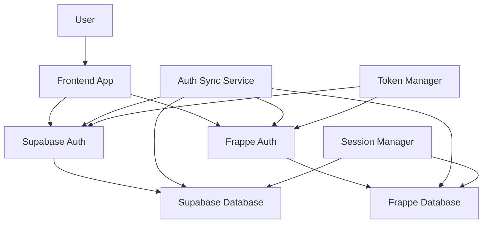

# Dual Authentication System Design
## Job Candidate Portal - Supabase + Frappe Authentication Integration

### Overview
This document outlines the design for a dual authentication system that integrates Supabase Auth with Frappe ERPNext authentication. The system provides seamless user authentication across both platforms while maintaining security and data consistency.

### Authentication Architecture

#### 1. System Overview


#### 2. Authentication Flow
1. **Primary Authentication**: User authenticates with Supabase Auth
2. **Token Exchange**: System exchanges Supabase token for Frappe token
3. **Session Synchronization**: Sessions are synchronized between both systems
4. **User Profile Sync**: User profile data is synchronized between platforms
5. **Role Management**: User roles are managed across both systems

### Authentication Components

#### 1. Supabase Auth Configuration
```typescript
// auth/supabase-config.ts
export const supabaseAuthConfig = {
  // Authentication providers
  providers: {
    email: {
      enabled: true,
      confirmation: true,
      passwordReset: true,
      magicLink: true
    },
    google: {
      enabled: true,
      clientId: process.env.GOOGLE_CLIENT_ID,
      clientSecret: process.env.GOOGLE_CLIENT_SECRET,
      redirectUri: `${process.env.SUPABASE_URL}/auth/v1/callback/google`
    },
    linkedin: {
      enabled: true,
      clientId: process.env.LINKEDIN_CLIENT_ID,
      clientSecret: process.env.LINKEDIN_CLIENT_SECRET,
      redirectUri: `${process.env.SUPABASE_URL}/auth/v1/callback/linkedin`
    }
  },

  // Session configuration
  session: {
    timeout: 3600, // 1 hour
    refreshTokenRotation: true,
    refreshTokenExpiry: 2592000, // 30 days
    accessTokenExpiry: 3600 // 1 hour
  },

  // Security settings
  security: {
    passwordMinLength: 8,
    passwordRequireUppercase: true,
    passwordRequireLowercase: true,
    passwordRequireNumbers: true,
    passwordRequireSymbols: false,
    maxLoginAttempts: 5,
    lockoutDuration: 900 // 15 minutes
  },

  // Multi-factor authentication
  mfa: {
    enabled: true,
    providers: ['totp'],
    backupCodes: true
  }
};
```

#### 2. Frappe Auth Configuration
```python
# auth/frappe-config.py
frappe_auth_config = {
    'api_key': os.environ.get('FRAPPE_API_KEY'),
    'api_secret': os.environ.get('FRAPPE_API_SECRET'),
    'base_url': os.environ.get('FRAPPE_URL'),
    'timeout': 30,
    'retry_attempts': 3,
    'session_timeout': 3600,  # 1 hour
    'token_refresh_threshold': 300,  # 5 minutes
}

# Custom Frappe authentication endpoints
frappe_auth_endpoints = {
    'login': '/api/method/login',
    'logout': '/api/method/logout',
    'token_refresh': '/api/method/frappe.auth.get_token',
    'user_info': '/api/method/frappe.auth.get_user_info',
    'password_reset': '/api/method/frappe.auth.reset_password',
    'change_password': '/api/method/frappe.auth.change_password'
}
```

### Authentication Service Implementation

#### 1. Dual Auth Service
```typescript
// auth/dual-auth-service.ts
import { createClient } from '@supabase/supabase-js';
import { FrappeClient } from '../integrations/frappe-client';

export interface AuthTokens {
  supabaseToken: string;
  frappeToken: string;
  refreshToken: string;
  expiresAt: number;
}

export interface UserProfile {
  id: string;
  email: string;
  firstName: string;
  lastName: string;
  role: string;
  isActive: boolean;
  lastLogin: Date;
  supabaseProfile: any;
  frappeProfile: any;
}

export class DualAuthService {
  private supabase: any;
  private frappeClient: FrappeClient;
  private tokenManager: TokenManager;
  private sessionManager: SessionManager;

  constructor() {
    this.supabase = createClient(
      process.env.SUPABASE_URL!,
      process.env.SUPABASE_ANON_KEY!
    );
    this.frappeClient = new FrappeClient(
      process.env.FRAPPE_URL!,
      process.env.FRAPPE_API_KEY!,
      process.env.FRAPPE_API_SECRET!
    );
    this.tokenManager = new TokenManager();
    this.sessionManager = new SessionManager();
  }

  async signIn(email: string, password: string): Promise<AuthTokens> {
    try {
      // Step 1: Authenticate with Supabase
      const { data: supabaseAuth, error: supabaseError } = await this.supabase.auth
        .signInWithPassword({ email, password });

      if (supabaseError) throw supabaseError;

      // Step 2: Exchange Supabase token for Frappe token
      const frappeToken = await this.exchangeTokenForFrappe(supabaseAuth.session.access_token);

      // Step 3: Create unified session
      const tokens: AuthTokens = {
        supabaseToken: supabaseAuth.session.access_token,
        frappeToken: frappeToken,
        refreshToken: supabaseAuth.session.refresh_token,
        expiresAt: Date.now() + (supabaseAuth.session.expires_in * 1000)
      };

      // Step 4: Store session and sync user data
      await this.sessionManager.createSession(supabaseAuth.user.id, tokens);
      await this.syncUserProfile(supabaseAuth.user.id);

      // Step 5: Log audit event
      await this.logAuthEvent('signin', supabaseAuth.user.id);

      return tokens;
    } catch (error) {
      await this.logAuthEvent('signin_failed', null, error.message);
      throw error;
    }
  }

  async signUp(email: string, password: string, userData: any): Promise<AuthTokens> {
    try {
      // Step 1: Create user in Supabase
      const { data: supabaseAuth, error: supabaseError } = await this.supabase.auth
        .signUp({
          email,
          password,
          options: {
            data: {
              first_name: userData.firstName,
              last_name: userData.lastName,
              phone: userData.phone
            }
          }
        });

      if (supabaseError) throw supabaseError;

      // Step 2: Create user in Frappe
      const frappeUser = await this.createFrappeUser(supabaseAuth.user, userData);

      // Step 3: Exchange tokens
      const frappeToken = await this.exchangeTokenForFrappe(supabaseAuth.session.access_token);

      // Step 4: Create unified session
      const tokens: AuthTokens = {
        supabaseToken: supabaseAuth.session.access_token,
        frappeToken: frappeToken,
        refreshToken: supabaseAuth.session.refresh_token,
        expiresAt: Date.now() + (supabaseAuth.session.expires_in * 1000)
      };

      // Step 5: Store session and sync user data
      await this.sessionManager.createSession(supabaseAuth.user.id, tokens);
      await this.syncUserProfile(supabaseAuth.user.id);

      // Step 6: Log audit event
      await this.logAuthEvent('signup', supabaseAuth.user.id);

      return tokens;
    } catch (error) {
      await this.logAuthEvent('signup_failed', null, error.message);
      throw error;
    }
  }

  async signOut(userId: string): Promise<void> {
    try {
      // Step 1: Get current session
      const session = await this.sessionManager.getSession(userId);
      if (!session) return;

      // Step 2: Sign out from Supabase
      await this.supabase.auth.signOut();

      // Step 3: Sign out from Frappe
      if (session.frappeToken) {
        await this.frappeClient.logout(session.frappeToken);
      }

      // Step 4: Remove session
      await this.sessionManager.removeSession(userId);

      // Step 5: Log audit event
      await this.logAuthEvent('signout', userId);
    } catch (error) {
      await this.logAuthEvent('signout_failed', userId, error.message);
      throw error;
    }
  }

  async refreshTokens(userId: string): Promise<AuthTokens> {
    try {
      // Step 1: Get current session
      const session = await this.sessionManager.getSession(userId);
      if (!session) throw new Error('No active session');

      // Step 2: Refresh Supabase token
      const { data: supabaseAuth, error: supabaseError } = await this.supabase.auth
        .refreshSession({ refresh_token: session.refreshToken });

      if (supabaseError) throw supabaseError;

      // Step 3: Exchange new Supabase token for Frappe token
      const frappeToken = await this.exchangeTokenForFrappe(supabaseAuth.session.access_token);

      // Step 4: Update session with new tokens
      const newTokens: AuthTokens = {
        supabaseToken: supabaseAuth.session.access_token,
        frappeToken: frappeToken,
        refreshToken: supabaseAuth.session.refresh_token,
        expiresAt: Date.now() + (supabaseAuth.session.expires_in * 1000)
      };

      await this.sessionManager.updateSession(userId, newTokens);

      return newTokens;
    } catch (error) {
      await this.logAuthEvent('token_refresh_failed', userId, error.message);
      throw error;
    }
  }

  async getUserProfile(userId: string): Promise<UserProfile> {
    try {
      // Step 1: Get Supabase profile
      const supabaseProfile = await this.supabase
        .from('users')
        .select('*')
        .eq('id', userId)
        .single();

      if (supabaseProfile.error) throw supabaseProfile.error;

      // Step 2: Get Frappe profile
      const frappeProfile = await this.frappeClient.getCandidateProfile(userId);

      // Step 3: Merge profiles
      const userProfile: UserProfile = {
        id: supabaseProfile.data.id,
        email: supabaseProfile.data.email,
        firstName: supabaseProfile.data.first_name,
        lastName: supabaseProfile.data.last_name,
        role: supabaseProfile.data.role,
        isActive: supabaseProfile.data.is_active,
        lastLogin: new Date(supabaseProfile.data.last_login_at),
        supabaseProfile: supabaseProfile.data,
        frappeProfile: frappeProfile
      };

      return userProfile;
    } catch (error) {
      throw new Error(`Failed to get user profile: ${error.message}`);
    }
  }

  private async exchangeTokenForFrappe(supabaseToken: string): Promise<string> {
    try {
      // Create Frappe user session using Supabase token
      const frappeAuth = await this.frappeClient.authenticateWithSupabaseToken(supabaseToken);
      return frappeAuth.token;
    } catch (error) {
      throw new Error(`Token exchange failed: ${error.message}`);
    }
  }

  private async createFrappeUser(supabaseUser: any, userData: any): Promise<any> {
    try {
      const frappeUserData = {
        candidate_id: supabaseUser.id,
        first_name: userData.firstName,
        last_name: userData.lastName,
        email: supabaseUser.email,
        phone: userData.phone,
        location: userData.location,
        bio: userData.bio,
        is_active: true
      };

      return await this.frappeClient.createCandidateProfile(frappeUserData);
    } catch (error) {
      throw new Error(`Frappe user creation failed: ${error.message}`);
    }
  }

  private async syncUserProfile(userId: string): Promise<void> {
    try {
      // Get user data from Supabase
      const supabaseUser = await this.supabase
        .from('users')
        .select('*')
        .eq('id', userId)
        .single();

      if (supabaseUser.error) throw supabaseUser.error;

      // Sync to Frappe
      const frappeProfileData = {
        candidate_id: userId,
        first_name: supabaseUser.data.first_name,
        last_name: supabaseUser.data.last_name,
        email: supabaseUser.data.email,
        phone: supabaseUser.data.phone,
        location: supabaseUser.data.location,
        bio: supabaseUser.data.bio,
        is_active: supabaseUser.data.is_active,
        last_login: new Date().toISOString()
      };

      await this.frappeClient.updateCandidateProfile(userId, frappeProfileData);
    } catch (error) {
      console.error(`Profile sync failed: ${error.message}`);
    }
  }

  private async logAuthEvent(event: string, userId: string | null, errorMessage?: string): Promise<void> {
    try {
      await this.supabase
        .from('audit_log')
        .insert({
          user_id: userId,
          action: event,
          resource_type: 'auth',
          new_values: { error_message: errorMessage },
          created_at: new Date().toISOString()
        });
    } catch (error) {
      console.error('Failed to log auth event:', error);
    }
  }
}
```

#### 2. Token Manager
```typescript
// auth/token-manager.ts
export class TokenManager {
  private tokenCache: Map<string, AuthTokens> = new Map();
  private refreshPromises: Map<string, Promise<AuthTokens>> = new Map();

  async getValidTokens(userId: string): Promise<AuthTokens | null> {
    try {
      // Check cache first
      const cachedTokens = this.tokenCache.get(userId);
      if (cachedTokens && this.isTokenValid(cachedTokens)) {
        return cachedTokens;
      }

      // Check if refresh is already in progress
      const refreshPromise = this.refreshPromises.get(userId);
      if (refreshPromise) {
        return await refreshPromise;
      }

      // Start refresh process
      const refreshPromise = this.refreshTokens(userId);
      this.refreshPromises.set(userId, refreshPromise);

      try {
        const newTokens = await refreshPromise;
        this.tokenCache.set(userId, newTokens);
        return newTokens;
      } finally {
        this.refreshPromises.delete(userId);
      }
    } catch (error) {
      console.error(`Token validation failed: ${error.message}`);
      return null;
    }
  }

  async refreshTokens(userId: string): Promise<AuthTokens> {
    try {
      // Get current session from database
      const session = await this.getSessionFromDatabase(userId);
      if (!session) throw new Error('No active session');

      // Refresh Supabase token
      const supabaseAuth = await this.refreshSupabaseToken(session.refreshToken);

      // Exchange for Frappe token
      const frappeToken = await this.exchangeTokenForFrappe(supabaseAuth.access_token);

      const newTokens: AuthTokens = {
        supabaseToken: supabaseAuth.access_token,
        frappeToken: frappeToken,
        refreshToken: supabaseAuth.refresh_token,
        expiresAt: Date.now() + (supabaseAuth.expires_in * 1000)
      };

      // Update session in database
      await this.updateSessionInDatabase(userId, newTokens);

      return newTokens;
    } catch (error) {
      throw new Error(`Token refresh failed: ${error.message}`);
    }
  }

  private isTokenValid(tokens: AuthTokens): boolean {
    const now = Date.now();
    const bufferTime = 5 * 60 * 1000; // 5 minutes buffer
    return tokens.expiresAt > (now + bufferTime);
  }

  private async getSessionFromDatabase(userId: string): Promise<any> {
    // Implementation to get session from database
    // This would query the sessions table
    return null;
  }

  private async updateSessionInDatabase(userId: string, tokens: AuthTokens): Promise<void> {
    // Implementation to update session in database
    // This would update the sessions table
  }

  private async refreshSupabaseToken(refreshToken: string): Promise<any> {
    // Implementation to refresh Supabase token
    return null;
  }

  private async exchangeTokenForFrappe(supabaseToken: string): Promise<string> {
    // Implementation to exchange token for Frappe
    return '';
  }
}
```

#### 3. Session Manager
```typescript
// auth/session-manager.ts
export class SessionManager {
  private supabase: any;

  constructor() {
    this.supabase = createClient(
      process.env.SUPABASE_URL!,
      process.env.SUPABASE_SERVICE_ROLE_KEY!
    );
  }

  async createSession(userId: string, tokens: AuthTokens): Promise<void> {
    try {
      await this.supabase
        .from('user_sessions')
        .insert({
          user_id: userId,
          supabase_token: tokens.supabaseToken,
          frappe_token: tokens.frappeToken,
          refresh_token: tokens.refreshToken,
          expires_at: new Date(tokens.expiresAt).toISOString(),
          created_at: new Date().toISOString(),
          updated_at: new Date().toISOString()
        });
    } catch (error) {
      throw new Error(`Session creation failed: ${error.message}`);
    }
  }

  async getSession(userId: string): Promise<any> {
    try {
      const { data, error } = await this.supabase
        .from('user_sessions')
        .select('*')
        .eq('user_id', userId)
        .eq('is_active', true)
        .single();

      if (error) throw error;
      return data;
    } catch (error) {
      return null;
    }
  }

  async updateSession(userId: string, tokens: AuthTokens): Promise<void> {
    try {
      await this.supabase
        .from('user_sessions')
        .update({
          supabase_token: tokens.supabaseToken,
          frappe_token: tokens.frappeToken,
          refresh_token: tokens.refreshToken,
          expires_at: new Date(tokens.expiresAt).toISOString(),
          updated_at: new Date().toISOString()
        })
        .eq('user_id', userId)
        .eq('is_active', true);
    } catch (error) {
      throw new Error(`Session update failed: ${error.message}`);
    }
  }

  async removeSession(userId: string): Promise<void> {
    try {
      await this.supabase
        .from('user_sessions')
        .update({ is_active: false })
        .eq('user_id', userId)
        .eq('is_active', true);
    } catch (error) {
      throw new Error(`Session removal failed: ${error.message}`);
    }
  }

  async cleanupExpiredSessions(): Promise<void> {
    try {
      const now = new Date().toISOString();
      await this.supabase
        .from('user_sessions')
        .update({ is_active: false })
        .lt('expires_at', now);
    } catch (error) {
      console.error('Session cleanup failed:', error);
    }
  }
}
```

### Database Schema for Authentication

#### 1. User Sessions Table
```sql
-- User sessions table for managing dual authentication
CREATE TABLE public.user_sessions (
  id UUID PRIMARY KEY DEFAULT gen_random_uuid(),
  user_id UUID REFERENCES public.users(id) ON DELETE CASCADE,
  supabase_token TEXT NOT NULL,
  frappe_token TEXT NOT NULL,
  refresh_token TEXT NOT NULL,
  expires_at TIMESTAMP WITH TIME ZONE NOT NULL,
  is_active BOOLEAN DEFAULT true,
  created_at TIMESTAMP WITH TIME ZONE DEFAULT NOW(),
  updated_at TIMESTAMP WITH TIME ZONE DEFAULT NOW()
);

-- Indexes for performance
CREATE INDEX idx_user_sessions_user_id ON public.user_sessions(user_id);
CREATE INDEX idx_user_sessions_active ON public.user_sessions(is_active);
CREATE INDEX idx_user_sessions_expires_at ON public.user_sessions(expires_at);

-- RLS policies
ALTER TABLE public.user_sessions ENABLE ROW LEVEL SECURITY;

CREATE POLICY "Users can view own sessions" ON public.user_sessions
  FOR SELECT USING (auth.uid() = user_id);

CREATE POLICY "Users can manage own sessions" ON public.user_sessions
  FOR ALL USING (auth.uid() = user_id);
```

#### 2. Authentication Audit Log
```sql
-- Authentication audit log table
CREATE TABLE public.auth_audit_log (
  id UUID PRIMARY KEY DEFAULT gen_random_uuid(),
  user_id UUID REFERENCES public.users(id),
  action VARCHAR(100) NOT NULL,
  success BOOLEAN NOT NULL,
  error_message TEXT,
  ip_address INET,
  user_agent TEXT,
  metadata JSONB DEFAULT '{}',
  created_at TIMESTAMP WITH TIME ZONE DEFAULT NOW()
);

-- Indexes for performance
CREATE INDEX idx_auth_audit_log_user_id ON public.auth_audit_log(user_id);
CREATE INDEX idx_auth_audit_log_action ON public.auth_audit_log(action);
CREATE INDEX idx_auth_audit_log_created_at ON public.auth_audit_log(created_at);

-- RLS policies
ALTER TABLE public.auth_audit_log ENABLE ROW LEVEL SECURITY;

CREATE POLICY "Users can view own auth audit log" ON public.auth_audit_log
  FOR SELECT USING (auth.uid() = user_id);

CREATE POLICY "Admins can view all auth audit log" ON public.auth_audit_log
  FOR SELECT USING (
    EXISTS (
      SELECT 1 FROM public.users 
      WHERE id = auth.uid() AND role IN ('admin', 'super_admin')
    )
  );
```

### Frontend Integration

#### 1. React Auth Context
```typescript
// auth/auth-context.tsx
import React, { createContext, useContext, useEffect, useState } from 'react';
import { DualAuthService, AuthTokens, UserProfile } from './dual-auth-service';

interface AuthContextType {
  user: UserProfile | null;
  tokens: AuthTokens | null;
  loading: boolean;
  signIn: (email: string, password: string) => Promise<void>;
  signUp: (email: string, password: string, userData: any) => Promise<void>;
  signOut: () => Promise<void>;
  refreshTokens: () => Promise<void>;
}

const AuthContext = createContext<AuthContextType | undefined>(undefined);

export const AuthProvider: React.FC<{ children: React.ReactNode }> = ({ children }) => {
  const [user, setUser] = useState<UserProfile | null>(null);
  const [tokens, setTokens] = useState<AuthTokens | null>(null);
  const [loading, setLoading] = useState(true);

  const authService = new DualAuthService();

  useEffect(() => {
    initializeAuth();
  }, []);

  const initializeAuth = async () => {
    try {
      // Check for existing session
      const storedTokens = localStorage.getItem('auth_tokens');
      if (storedTokens) {
        const parsedTokens = JSON.parse(storedTokens);
        setTokens(parsedTokens);

        // Validate tokens and get user profile
        const userProfile = await authService.getUserProfile(parsedTokens.userId);
        setUser(userProfile);
      }
    } catch (error) {
      console.error('Auth initialization failed:', error);
      localStorage.removeItem('auth_tokens');
    } finally {
      setLoading(false);
    }
  };

  const signIn = async (email: string, password: string) => {
    try {
      setLoading(true);
      const newTokens = await authService.signIn(email, password);
      setTokens(newTokens);

      const userProfile = await authService.getUserProfile(newTokens.userId);
      setUser(userProfile);

      // Store tokens in localStorage
      localStorage.setItem('auth_tokens', JSON.stringify(newTokens));
    } catch (error) {
      throw error;
    } finally {
      setLoading(false);
    }
  };

  const signUp = async (email: string, password: string, userData: any) => {
    try {
      setLoading(true);
      const newTokens = await authService.signUp(email, password, userData);
      setTokens(newTokens);

      const userProfile = await authService.getUserProfile(newTokens.userId);
      setUser(userProfile);

      // Store tokens in localStorage
      localStorage.setItem('auth_tokens', JSON.stringify(newTokens));
    } catch (error) {
      throw error;
    } finally {
      setLoading(false);
    }
  };

  const signOut = async () => {
    try {
      if (user) {
        await authService.signOut(user.id);
      }
      
      setUser(null);
      setTokens(null);
      localStorage.removeItem('auth_tokens');
    } catch (error) {
      console.error('Sign out failed:', error);
    }
  };

  const refreshTokens = async () => {
    try {
      if (user) {
        const newTokens = await authService.refreshTokens(user.id);
        setTokens(newTokens);
        localStorage.setItem('auth_tokens', JSON.stringify(newTokens));
      }
    } catch (error) {
      console.error('Token refresh failed:', error);
      await signOut();
    }
  };

  const value: AuthContextType = {
    user,
    tokens,
    loading,
    signIn,
    signUp,
    signOut,
    refreshTokens
  };

  return (
    <AuthContext.Provider value={value}>
      {children}
    </AuthContext.Provider>
  );
};

export const useAuth = () => {
  const context = useContext(AuthContext);
  if (context === undefined) {
    throw new Error('useAuth must be used within an AuthProvider');
  }
  return context;
};
```

#### 2. Auth Guard Component
```typescript
// auth/auth-guard.tsx
import React from 'react';
import { useAuth } from './auth-context';

interface AuthGuardProps {
  children: React.ReactNode;
  requireAuth?: boolean;
  allowedRoles?: string[];
}

export const AuthGuard: React.FC<AuthGuardProps> = ({ 
  children, 
  requireAuth = true, 
  allowedRoles = [] 
}) => {
  const { user, loading } = useAuth();

  if (loading) {
    return <div>Loading...</div>;
  }

  if (requireAuth && !user) {
    return <div>Please sign in to access this page.</div>;
  }

  if (allowedRoles.length > 0 && user && !allowedRoles.includes(user.role)) {
    return <div>You don't have permission to access this page.</div>;
  }

  return <>{children}</>;
};
```

### Security Considerations

#### 1. Token Security
```typescript
// auth/token-security.ts
export class TokenSecurity {
  private static readonly TOKEN_STORAGE_KEY = 'auth_tokens';
  private static readonly TOKEN_REFRESH_THRESHOLD = 5 * 60 * 1000; // 5 minutes

  static storeTokensSecurely(tokens: AuthTokens): void {
    try {
      // Encrypt tokens before storing
      const encryptedTokens = this.encryptTokens(tokens);
      localStorage.setItem(this.TOKEN_STORAGE_KEY, encryptedTokens);
    } catch (error) {
      console.error('Token storage failed:', error);
    }
  }

  static getStoredTokens(): AuthTokens | null {
    try {
      const storedTokens = localStorage.getItem(this.TOKEN_STORAGE_KEY);
      if (!storedTokens) return null;

      const decryptedTokens = this.decryptTokens(storedTokens);
      return decryptedTokens;
    } catch (error) {
      console.error('Token retrieval failed:', error);
      return null;
    }
  }

  static clearStoredTokens(): void {
    localStorage.removeItem(this.TOKEN_STORAGE_KEY);
  }

  static shouldRefreshToken(tokens: AuthTokens): boolean {
    const now = Date.now();
    const timeUntilExpiry = tokens.expiresAt - now;
    return timeUntilExpiry < this.TOKEN_REFRESH_THRESHOLD;
  }

  private static encryptTokens(tokens: AuthTokens): string {
    // Simple encryption - in production, use a proper encryption library
    const tokenString = JSON.stringify(tokens);
    return btoa(tokenString);
  }

  private static decryptTokens(encryptedTokens: string): AuthTokens {
    // Simple decryption - in production, use a proper decryption library
    const tokenString = atob(encryptedTokens);
    return JSON.parse(tokenString);
  }
}
```

#### 2. Session Security
```typescript
// auth/session-security.ts
export class SessionSecurity {
  private static readonly MAX_CONCURRENT_SESSIONS = 3;
  private static readonly SESSION_TIMEOUT = 24 * 60 * 60 * 1000; // 24 hours

  static async validateSession(userId: string, sessionId: string): Promise<boolean> {
    try {
      // Check if session exists and is active
      const session = await this.getSessionFromDatabase(sessionId);
      if (!session || !session.is_active) return false;

      // Check if session has expired
      if (new Date(session.expires_at) < new Date()) return false;

      // Check if user matches
      if (session.user_id !== userId) return false;

      return true;
    } catch (error) {
      console.error('Session validation failed:', error);
      return false;
    }
  }

  static async enforceSessionLimit(userId: string): Promise<void> {
    try {
      const activeSessions = await this.getActiveSessions(userId);
      
      if (activeSessions.length >= this.MAX_CONCURRENT_SESSIONS) {
        // Remove oldest session
        const oldestSession = activeSessions.sort((a, b) => 
          new Date(a.created_at).getTime() - new Date(b.created_at).getTime()
        )[0];

        await this.removeSession(oldestSession.id);
      }
    } catch (error) {
      console.error('Session limit enforcement failed:', error);
    }
  }

  static async cleanupExpiredSessions(): Promise<void> {
    try {
      const now = new Date().toISOString();
      await this.removeExpiredSessions(now);
    } catch (error) {
      console.error('Session cleanup failed:', error);
    }
  }

  private static async getSessionFromDatabase(sessionId: string): Promise<any> {
    // Implementation to get session from database
    return null;
  }

  private static async getActiveSessions(userId: string): Promise<any[]> {
    // Implementation to get active sessions for user
    return [];
  }

  private static async removeSession(sessionId: string): Promise<void> {
    // Implementation to remove session
  }

  private static async removeExpiredSessions(expiryTime: string): Promise<void> {
    // Implementation to remove expired sessions
  }
}
```

### Monitoring & Analytics

#### 1. Authentication Metrics
```typescript
// auth/auth-metrics.ts
export class AuthMetrics {
  private supabase: any;

  constructor() {
    this.supabase = createClient(
      process.env.SUPABASE_URL!,
      process.env.SUPABASE_SERVICE_ROLE_KEY!
    );
  }

  async getAuthStats(days: number = 7): Promise<any> {
    try {
      const endDate = new Date();
      const startDate = new Date(endDate.getTime() - (days * 24 * 60 * 60 * 1000));

      const { data: stats, error } = await this.supabase
        .from('auth_audit_log')
        .select('action, success, created_at')
        .gte('created_at', startDate.toISOString())
        .lte('created_at', endDate.toISOString());

      if (error) throw error;

      const metrics = {
        totalLogins: stats.filter(s => s.action === 'signin' && s.success).length,
        totalSignups: stats.filter(s => s.action === 'signup' && s.success).length,
        failedLogins: stats.filter(s => s.action === 'signin' && !s.success).length,
        failedSignups: stats.filter(s => s.action === 'signup' && !s.success).length,
        totalSessions: stats.filter(s => s.action === 'signin' && s.success).length,
        activeSessions: await this.getActiveSessionCount(),
        averageSessionDuration: await this.getAverageSessionDuration(),
        topFailureReasons: await this.getTopFailureReasons()
      };

      return metrics;
    } catch (error) {
      console.error('Failed to get auth stats:', error);
      return {};
    }
  }

  private async getActiveSessionCount(): Promise<number> {
    try {
      const { count, error } = await this.supabase
        .from('user_sessions')
        .select('*', { count: 'exact', head: true })
        .eq('is_active', true);

      if (error) throw error;
      return count || 0;
    } catch (error) {
      return 0;
    }
  }

  private async getAverageSessionDuration(): Promise<number> {
    try {
      const { data, error } = await this.supabase
        .from('user_sessions')
        .select('created_at, updated_at')
        .eq('is_active', false);

      if (error) throw error;

      if (!data || data.length === 0) return 0;

      const durations = data.map(session => {
        const start = new Date(session.created_at).getTime();
        const end = new Date(session.updated_at).getTime();
        return end - start;
      });

      const averageDuration = durations.reduce((sum, duration) => sum + duration, 0) / durations.length;
      return Math.round(averageDuration / (1000 * 60)); // Convert to minutes
    } catch (error) {
      return 0;
    }
  }

  private async getTopFailureReasons(): Promise<any[]> {
    try {
      const { data, error } = await this.supabase
        .from('auth_audit_log')
        .select('error_message')
        .eq('success', false)
        .not('error_message', 'is', null);

      if (error) throw error;

      const errorCounts = data.reduce((acc, log) => {
        const error = log.error_message || 'Unknown error';
        acc[error] = (acc[error] || 0) + 1;
        return acc;
      }, {});

      return Object.entries(errorCounts)
        .map(([error, count]) => ({ error, count }))
        .sort((a, b) => b.count - a.count)
        .slice(0, 5);
    } catch (error) {
      return [];
    }
  }
}
```

### Conclusion

The dual authentication system provides a robust and secure authentication solution that integrates Supabase Auth with Frappe ERPNext. Key features include:

**Security Features:**
- Token-based authentication with automatic refresh
- Session management with concurrent session limits
- Comprehensive audit logging
- Secure token storage and encryption
- Multi-factor authentication support

**Integration Benefits:**
- Seamless user experience across both platforms
- Unified user profile management
- Real-time session synchronization
- Comprehensive error handling and recovery

**Monitoring & Analytics:**
- Authentication metrics and statistics
- Session duration tracking
- Failure reason analysis
- Security monitoring and alerting

This system ensures that users can authenticate once and access both the Job Candidate Portal and Frappe ERPNext seamlessly while maintaining the highest security standards.
