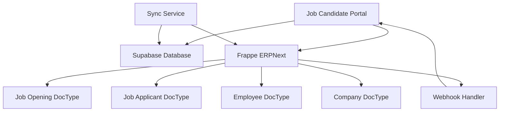

# Frappe ERPNext Integration Requirements
## Job Candidate Portal - Frappe ERPNext Integration Specification

### Overview
This document defines the integration requirements between the Job Candidate Portal and Frappe ERPNext. The integration enables seamless synchronization of job data, application management, and candidate information between the two systems.

### Integration Architecture

#### 1. System Overview


#### 2. Data Flow
- **Job Data**: Frappe ERPNext → Job Candidate Portal
- **Application Data**: Job Candidate Portal → Frappe ERPNext
- **Candidate Data**: Job Candidate Portal → Frappe ERPNext
- **Status Updates**: Bidirectional synchronization

### Frappe ERPNext Configuration

#### 1. Custom DocTypes Required

##### Job Opening DocType Extensions
```python
# Custom fields to add to Job Opening DocType
custom_fields = [
    {
        "fieldname": "portal_sync_status",
        "label": "Portal Sync Status",
        "fieldtype": "Select",
        "options": "Synced\nPending\nError",
        "default": "Pending",
        "read_only": 1
    },
    {
        "fieldname": "portal_job_id",
        "label": "Portal Job ID",
        "fieldtype": "Data",
        "read_only": 1
    },
    {
        "fieldname": "last_sync_date",
        "label": "Last Sync Date",
        "fieldtype": "Datetime",
        "read_only": 1
    },
    {
        "fieldname": "sync_error_message",
        "label": "Sync Error Message",
        "fieldtype": "Text",
        "read_only": 1
    },
    {
        "fieldname": "is_featured",
        "label": "Featured Job",
        "fieldtype": "Check",
        "default": 0
    },
    {
        "fieldname": "job_tags",
        "label": "Job Tags",
        "fieldtype": "Small Text"
    },
    {
        "fieldname": "remote_work_allowed",
        "label": "Remote Work Allowed",
        "fieldtype": "Check",
        "default": 0
    },
    {
        "fieldname": "benefits_description",
        "label": "Benefits Description",
        "fieldtype": "Text"
    }
]
```

##### Job Applicant DocType Extensions
```python
# Custom fields to add to Job Applicant DocType
custom_fields = [
    {
        "fieldname": "portal_application_id",
        "label": "Portal Application ID",
        "fieldtype": "Data",
        "read_only": 1
    },
    {
        "fieldname": "portal_sync_status",
        "label": "Portal Sync Status",
        "fieldtype": "Select",
        "options": "Synced\nPending\nError",
        "default": "Pending",
        "read_only": 1
    },
    {
        "fieldname": "last_sync_date",
        "label": "Last Sync Date",
        "fieldtype": "Datetime",
        "read_only": 1
    },
    {
        "fieldname": "sync_error_message",
        "label": "Sync Error Message",
        "fieldtype": "Text",
        "read_only": 1
    },
    {
        "fieldname": "cover_letter",
        "label": "Cover Letter",
        "fieldtype": "Text"
    },
    {
        "fieldname": "resume_url",
        "label": "Resume URL",
        "fieldtype": "Data"
    },
    {
        "fieldname": "additional_documents",
        "label": "Additional Documents",
        "fieldtype": "JSON"
    },
    {
        "fieldname": "application_notes",
        "label": "Application Notes",
        "fieldtype": "Text"
    }
]
```

##### Candidate Profile DocType (New)
```python
# New DocType for candidate profiles
candidate_profile_fields = [
    {
        "fieldname": "candidate_id",
        "label": "Candidate ID",
        "fieldtype": "Data",
        "unique": 1
    },
    {
        "fieldname": "first_name",
        "label": "First Name",
        "fieldtype": "Data",
        "reqd": 1
    },
    {
        "fieldname": "last_name",
        "label": "Last Name",
        "fieldtype": "Data",
        "reqd": 1
    },
    {
        "fieldname": "email",
        "label": "Email",
        "fieldtype": "Data",
        "reqd": 1
    },
    {
        "fieldname": "phone",
        "label": "Phone",
        "fieldtype": "Data"
    },
    {
        "fieldname": "location",
        "label": "Location",
        "fieldtype": "Data"
    },
    {
        "fieldname": "bio",
        "label": "Bio",
        "fieldtype": "Text"
    },
    {
        "fieldname": "skills",
        "label": "Skills",
        "fieldtype": "Table",
        "options": "Candidate Skill"
    },
    {
        "fieldname": "experience",
        "label": "Work Experience",
        "fieldtype": "Table",
        "options": "Candidate Experience"
    },
    {
        "fieldname": "education",
        "label": "Education",
        "fieldtype": "Table",
        "options": "Candidate Education"
    },
    {
        "fieldname": "preferences",
        "label": "Job Preferences",
        "fieldtype": "JSON"
    },
    {
        "fieldname": "social_links",
        "label": "Social Links",
        "fieldtype": "JSON"
    },
    {
        "fieldname": "availability",
        "label": "Availability",
        "fieldtype": "JSON"
    },
    {
        "fieldname": "is_active",
        "label": "Is Active",
        "fieldtype": "Check",
        "default": 1
    },
    {
        "fieldname": "last_login",
        "label": "Last Login",
        "fieldtype": "Datetime"
    }
]
```

#### 2. Child DocTypes

##### Candidate Skill DocType
```python
candidate_skill_fields = [
    {
        "fieldname": "skill_name",
        "label": "Skill Name",
        "fieldtype": "Data",
        "reqd": 1
    },
    {
        "fieldname": "skill_level",
        "label": "Skill Level",
        "fieldtype": "Select",
        "options": "Beginner\nIntermediate\nAdvanced\nExpert",
        "reqd": 1
    },
    {
        "fieldname": "years_experience",
        "label": "Years of Experience",
        "fieldtype": "Float"
    }
]
```

##### Candidate Experience DocType
```python
candidate_experience_fields = [
    {
        "fieldname": "company_name",
        "label": "Company Name",
        "fieldtype": "Data",
        "reqd": 1
    },
    {
        "fieldname": "job_title",
        "label": "Job Title",
        "fieldtype": "Data",
        "reqd": 1
    },
    {
        "fieldname": "start_date",
        "label": "Start Date",
        "fieldtype": "Date",
        "reqd": 1
    },
    {
        "fieldname": "end_date",
        "label": "End Date",
        "fieldtype": "Date"
    },
    {
        "fieldname": "is_current",
        "label": "Current Job",
        "fieldtype": "Check",
        "default": 0
    },
    {
        "fieldname": "description",
        "label": "Job Description",
        "fieldtype": "Text"
    },
    {
        "fieldname": "location",
        "label": "Location",
        "fieldtype": "Data"
    }
]
```

##### Candidate Education DocType
```python
candidate_education_fields = [
    {
        "fieldname": "institution",
        "label": "Institution",
        "fieldtype": "Data",
        "reqd": 1
    },
    {
        "fieldname": "degree",
        "label": "Degree",
        "fieldtype": "Data",
        "reqd": 1
    },
    {
        "fieldname": "field_of_study",
        "label": "Field of Study",
        "fieldtype": "Data"
    },
    {
        "fieldname": "start_date",
        "label": "Start Date",
        "fieldtype": "Date"
    },
    {
        "fieldname": "end_date",
        "label": "End Date",
        "fieldtype": "Date"
    },
    {
        "fieldname": "gpa",
        "label": "GPA",
        "fieldtype": "Float"
    },
    {
        "fieldname": "is_completed",
        "label": "Completed",
        "fieldtype": "Check",
        "default": 1
    }
]
```

### API Integration Specifications

#### 1. Frappe ERPNext API Client
```python
# frappe_client.py
import requests
import json
from typing import Dict, List, Optional
from datetime import datetime

class FrappeClient:
    def __init__(self, url: str, api_key: str, api_secret: str):
        self.url = url.rstrip('/')
        self.api_key = api_key
        self.api_secret = api_secret
        self.session = requests.Session()
        self.session.headers.update({
            'Authorization': f'token {api_key}:{api_secret}',
            'Content-Type': 'application/json'
        })
    
    def get_job_openings(self, filters: Optional[Dict] = None) -> List[Dict]:
        """Fetch job openings from Frappe ERPNext"""
        params = {
            'doctype': 'Job Opening',
            'fields': [
                'name', 'job_title', 'company', 'location', 'department',
                'experience_level', 'job_type', 'salary_min', 'salary_max',
                'description', 'requirements', 'benefits', 'posted_date',
                'expiry_date', 'status', 'is_featured', 'job_tags',
                'remote_work_allowed', 'benefits_description'
            ],
            'filters': filters or {'status': 'Open'},
            'limit_page_length': 1000
        }
        
        response = self.session.post(
            f'{self.url}/api/method/frappe.client.get_list',
            json=params
        )
        response.raise_for_status()
        return response.json()['message']
    
    def create_job_applicant(self, applicant_data: Dict) -> Dict:
        """Create a new job applicant in Frappe ERPNext"""
        params = {
            'doctype': 'Job Applicant',
            'data': applicant_data
        }
        
        response = self.session.post(
            f'{self.url}/api/method/frappe.client.insert',
            json=params
        )
        response.raise_for_status()
        return response.json()['message']
    
    def update_job_applicant(self, name: str, data: Dict) -> Dict:
        """Update an existing job applicant"""
        params = {
            'doctype': 'Job Applicant',
            'name': name,
            'data': data
        }
        
        response = self.session.post(
            f'{self.url}/api/method/frappe.client.update',
            json=params
        )
        response.raise_for_status()
        return response.json()['message']
    
    def get_job_applicant(self, name: str) -> Dict:
        """Get a specific job applicant"""
        params = {
            'doctype': 'Job Applicant',
            'name': name
        }
        
        response = self.session.post(
            f'{self.url}/api/method/frappe.client.get',
            json=params
        )
        response.raise_for_status()
        return response.json()['message']
    
    def create_candidate_profile(self, profile_data: Dict) -> Dict:
        """Create a new candidate profile"""
        params = {
            'doctype': 'Candidate Profile',
            'data': profile_data
        }
        
        response = self.session.post(
            f'{self.url}/api/method/frappe.client.insert',
            json=params
        )
        response.raise_for_status()
        return response.json()['message']
    
    def update_candidate_profile(self, name: str, data: Dict) -> Dict:
        """Update an existing candidate profile"""
        params = {
            'doctype': 'Candidate Profile',
            'name': name,
            'data': data
        }
        
        response = self.session.post(
            f'{self.url}/api/method/frappe.client.update',
            json=params
        )
        response.raise_for_status()
        return response.json()['message']
    
    def get_candidate_profile(self, candidate_id: str) -> Optional[Dict]:
        """Get candidate profile by candidate ID"""
        params = {
            'doctype': 'Candidate Profile',
            'filters': {'candidate_id': candidate_id},
            'limit_page_length': 1
        }
        
        response = self.session.post(
            f'{self.url}/api/method/frappe.client.get_list',
            json=params
        )
        response.raise_for_status()
        
        results = response.json()['message']
        return results[0] if results else None
    
    def update_job_opening_sync_status(self, name: str, status: str, 
                                     portal_job_id: str = None, 
                                     error_message: str = None) -> Dict:
        """Update job opening sync status"""
        data = {
            'portal_sync_status': status,
            'last_sync_date': datetime.now().isoformat()
        }
        
        if portal_job_id:
            data['portal_job_id'] = portal_job_id
        
        if error_message:
            data['sync_error_message'] = error_message
        
        params = {
            'doctype': 'Job Opening',
            'name': name,
            'data': data
        }
        
        response = self.session.post(
            f'{self.url}/api/method/frappe.client.update',
            json=params
        )
        response.raise_for_status()
        return response.json()['message']
    
    def update_job_applicant_sync_status(self, name: str, status: str,
                                       portal_application_id: str = None,
                                       error_message: str = None) -> Dict:
        """Update job applicant sync status"""
        data = {
            'portal_sync_status': status,
            'last_sync_date': datetime.now().isoformat()
        }
        
        if portal_application_id:
            data['portal_application_id'] = portal_application_id
        
        if error_message:
            data['sync_error_message'] = error_message
        
        params = {
            'doctype': 'Job Applicant',
            'name': name,
            'data': data
        }
        
        response = self.session.post(
            f'{self.url}/api/method/frappe.client.update',
            json=params
        )
        response.raise_for_status()
        return response.json()['message']
```

#### 2. Data Synchronization Service
```python
# sync_service.py
import asyncio
import logging
from typing import Dict, List, Optional
from datetime import datetime, timedelta
from frappe_client import FrappeClient
from supabase_client import SupabaseClient

class SyncService:
    def __init__(self, frappe_client: FrappeClient, supabase_client: SupabaseClient):
        self.frappe_client = frappe_client
        self.supabase_client = supabase_client
        self.logger = logging.getLogger(__name__)
    
    async def sync_jobs_from_frappe(self) -> Dict:
        """Sync job openings from Frappe ERPNext to Supabase"""
        try:
            # Get jobs that need syncing
            frappe_jobs = self.frappe_client.get_job_openings({
                'portal_sync_status': ['in', ['Pending', 'Error']]
            })
            
            synced_count = 0
            error_count = 0
            errors = []
            
            for job in frappe_jobs:
                try:
                    # Check if company exists in Supabase
                    company_id = await self._get_or_create_company(job['company'])
                    
                    # Prepare job data for Supabase
                    job_data = {
                        'frappe_job_id': job['name'],
                        'company_id': company_id,
                        'title': job['job_title'],
                        'slug': self._generate_slug(job['job_title']),
                        'location': job.get('location'),
                        'department': job.get('department'),
                        'experience_level': job.get('experience_level'),
                        'job_type': job.get('job_type'),
                        'salary_range': {
                            'min': job.get('salary_min'),
                            'max': job.get('salary_max')
                        },
                        'description': job.get('description'),
                        'requirements': job.get('requirements'),
                        'benefits': job.get('benefits_description') or job.get('benefits'),
                        'tags': self._parse_tags(job.get('job_tags')),
                        'status': 'active' if job['status'] == 'Open' else 'inactive',
                        'is_featured': job.get('is_featured', False),
                        'is_remote': job.get('remote_work_allowed', False),
                        'posted_at': job.get('posted_date'),
                        'expires_at': job.get('expiry_date')
                    }
                    
                    # Check if job already exists in Supabase
                    existing_job = await self.supabase_client.get_job_by_frappe_id(job['name'])
                    
                    if existing_job:
                        # Update existing job
                        await self.supabase_client.update_job(existing_job['id'], job_data)
                        portal_job_id = existing_job['id']
                    else:
                        # Create new job
                        portal_job_id = await self.supabase_client.create_job(job_data)
                    
                    # Update sync status in Frappe
                    self.frappe_client.update_job_opening_sync_status(
                        job['name'], 'Synced', portal_job_id
                    )
                    
                    synced_count += 1
                    self.logger.info(f"Synced job: {job['name']}")
                    
                except Exception as e:
                    error_count += 1
                    error_msg = f"Failed to sync job {job['name']}: {str(e)}"
                    errors.append(error_msg)
                    self.logger.error(error_msg)
                    
                    # Update error status in Frappe
                    self.frappe_client.update_job_opening_sync_status(
                        job['name'], 'Error', error_message=error_msg
                    )
            
            return {
                'synced': synced_count,
                'errors': error_count,
                'error_messages': errors,
                'total': len(frappe_jobs)
            }
            
        except Exception as e:
            self.logger.error(f"Job sync failed: {str(e)}")
            raise
    
    async def sync_application_to_frappe(self, application_data: Dict) -> Dict:
        """Sync application from Supabase to Frappe ERPNext"""
        try:
            # Get job details from Supabase
            job = await self.supabase_client.get_job(application_data['job_id'])
            if not job:
                raise ValueError(f"Job not found: {application_data['job_id']}")
            
            # Get user details from Supabase
            user = await self.supabase_client.get_user(application_data['user_id'])
            if not user:
                raise ValueError(f"User not found: {application_data['user_id']}")
            
            # Prepare applicant data for Frappe
            applicant_data = {
                'job_title': job['title'],
                'company': job['company']['name'],
                'applicant_name': f"{user['first_name']} {user['last_name']}",
                'email_id': user['email'],
                'phone_number': user.get('phone'),
                'cover_letter': application_data.get('cover_letter'),
                'resume_url': application_data.get('resume_url'),
                'additional_documents': application_data.get('additional_documents', []),
                'application_notes': application_data.get('notes'),
                'status': self._map_application_status(application_data['status']),
                'portal_application_id': application_data['id'],
                'portal_sync_status': 'Pending'
            }
            
            # Create job applicant in Frappe
            frappe_applicant = self.frappe_client.create_job_applicant(applicant_data)
            
            # Update sync status in Frappe
            self.frappe_client.update_job_applicant_sync_status(
                frappe_applicant['name'], 'Synced', application_data['id']
            )
            
            # Update application in Supabase with Frappe ID
            await self.supabase_client.update_application(application_data['id'], {
                'frappe_applicant_id': frappe_applicant['name']
            })
            
            self.logger.info(f"Synced application: {application_data['id']}")
            
            return {
                'success': True,
                'frappe_applicant_id': frappe_applicant['name'],
                'message': 'Application synced successfully'
            }
            
        except Exception as e:
            self.logger.error(f"Application sync failed: {str(e)}")
            raise
    
    async def sync_candidate_profile_to_frappe(self, user_data: Dict) -> Dict:
        """Sync candidate profile from Supabase to Frappe ERPNext"""
        try:
            # Check if candidate profile already exists
            existing_profile = self.frappe_client.get_candidate_profile(user_data['id'])
            
            # Prepare profile data for Frappe
            profile_data = {
                'candidate_id': user_data['id'],
                'first_name': user_data['first_name'],
                'last_name': user_data['last_name'],
                'email': user_data['email'],
                'phone': user_data.get('phone'),
                'location': user_data.get('location'),
                'bio': user_data.get('bio'),
                'is_active': user_data.get('is_active', True),
                'last_login': user_data.get('last_login_at')
            }
            
            if existing_profile:
                # Update existing profile
                frappe_profile = self.frappe_client.update_candidate_profile(
                    existing_profile['name'], profile_data
                )
            else:
                # Create new profile
                frappe_profile = self.frappe_client.create_candidate_profile(profile_data)
            
            self.logger.info(f"Synced candidate profile: {user_data['id']}")
            
            return {
                'success': True,
                'frappe_profile_id': frappe_profile['name'],
                'message': 'Candidate profile synced successfully'
            }
            
        except Exception as e:
            self.logger.error(f"Candidate profile sync failed: {str(e)}")
            raise
    
    async def _get_or_create_company(self, company_name: str) -> str:
        """Get or create company in Supabase"""
        # Check if company exists
        existing_company = await self.supabase_client.get_company_by_name(company_name)
        
        if existing_company:
            return existing_company['id']
        
        # Create new company
        company_data = {
            'name': company_name,
            'slug': self._generate_slug(company_name),
            'is_verified': False
        }
        
        return await self.supabase_client.create_company(company_data)
    
    def _generate_slug(self, text: str) -> str:
        """Generate URL-friendly slug from text"""
        import re
        slug = re.sub(r'[^\w\s-]', '', text.lower())
        slug = re.sub(r'[-\s]+', '-', slug)
        return slug.strip('-')
    
    def _parse_tags(self, tags_string: str) -> List[str]:
        """Parse comma-separated tags string into list"""
        if not tags_string:
            return []
        return [tag.strip() for tag in tags_string.split(',') if tag.strip()]
    
    def _map_application_status(self, portal_status: str) -> str:
        """Map portal application status to Frappe status"""
        status_mapping = {
            'applied': 'Applied',
            'review': 'Under Review',
            'interview': 'Interview Scheduled',
            'offer': 'Job Offer',
            'rejected': 'Rejected',
            'withdrawn': 'Withdrawn'
        }
        return status_mapping.get(portal_status, 'Applied')
```

### Webhook Integration

#### 1. Frappe ERPNext Webhook Configuration
```python
# webhook_config.py
webhook_config = {
    'job_opening_events': [
        {
            'event': 'Job Opening',
            'method': 'POST',
            'url': 'https://your-portal.com/api/webhooks/frappe/job-opening',
            'enabled': True,
            'conditions': [
                {'field': 'status', 'operator': '=', 'value': 'Open'},
                {'field': 'portal_sync_status', 'operator': '!=', 'value': 'Synced'}
            ]
        }
    ],
    'job_applicant_events': [
        {
            'event': 'Job Applicant',
            'method': 'POST',
            'url': 'https://your-portal.com/api/webhooks/frappe/job-applicant',
            'enabled': True,
            'conditions': [
                {'field': 'portal_sync_status', 'operator': '=', 'value': 'Synced'}
            ]
        }
    ]
}
```

#### 2. Webhook Handler Implementation
```python
# webhook_handler.py
from flask import Flask, request, jsonify
import logging
from sync_service import SyncService

app = Flask(__name__)
logger = logging.getLogger(__name__)

# Initialize sync service
sync_service = SyncService(frappe_client, supabase_client)

@app.route('/api/webhooks/frappe/job-opening', methods=['POST'])
def handle_job_opening_webhook():
    """Handle job opening webhook from Frappe ERPNext"""
    try:
        data = request.get_json()
        
        if not data:
            return jsonify({'error': 'No data provided'}), 400
        
        # Extract job opening data
        job_opening = data.get('data', {})
        
        if not job_opening:
            return jsonify({'error': 'No job opening data'}), 400
        
        # Process the webhook
        result = asyncio.run(sync_service.sync_jobs_from_frappe())
        
        return jsonify({
            'success': True,
            'message': 'Job opening webhook processed',
            'result': result
        }), 200
        
    except Exception as e:
        logger.error(f"Job opening webhook error: {str(e)}")
        return jsonify({'error': str(e)}), 500

@app.route('/api/webhooks/frappe/job-applicant', methods=['POST'])
def handle_job_applicant_webhook():
    """Handle job applicant webhook from Frappe ERPNext"""
    try:
        data = request.get_json()
        
        if not data:
            return jsonify({'error': 'No data provided'}), 400
        
        # Extract job applicant data
        job_applicant = data.get('data', {})
        
        if not job_applicant:
            return jsonify({'error': 'No job applicant data'}), 400
        
        # Get portal application ID
        portal_application_id = job_applicant.get('portal_application_id')
        
        if not portal_application_id:
            return jsonify({'error': 'No portal application ID'}), 400
        
        # Update application status in portal
        status_mapping = {
            'Applied': 'applied',
            'Under Review': 'review',
            'Interview Scheduled': 'interview',
            'Job Offer': 'offer',
            'Rejected': 'rejected',
            'Withdrawn': 'withdrawn'
        }
        
        portal_status = status_mapping.get(job_applicant.get('status'), 'applied')
        
        # Update application in Supabase
        result = asyncio.run(supabase_client.update_application(
            portal_application_id, {'status': portal_status}
        ))
        
        return jsonify({
            'success': True,
            'message': 'Job applicant webhook processed',
            'result': result
        }), 200
        
    except Exception as e:
        logger.error(f"Job applicant webhook error: {str(e)}")
        return jsonify({'error': str(e)}), 500

if __name__ == '__main__':
    app.run(host='0.0.0.0', port=5000)
```

### Data Mapping Specifications

#### 1. Job Opening Mapping
```python
# job_mapping.py
job_opening_mapping = {
    'frappe_to_portal': {
        'name': 'frappe_job_id',
        'job_title': 'title',
        'company': 'company_id',  # Will be resolved to company ID
        'location': 'location',
        'department': 'department',
        'experience_level': 'experience_level',
        'job_type': 'job_type',
        'salary_min': 'salary_range.min',
        'salary_max': 'salary_range.max',
        'description': 'description',
        'requirements': 'requirements',
        'benefits_description': 'benefits',
        'posted_date': 'posted_at',
        'expiry_date': 'expires_at',
        'status': 'status',  # Mapped: Open -> active, Closed -> inactive
        'is_featured': 'is_featured',
        'remote_work_allowed': 'is_remote',
        'job_tags': 'tags'  # Parsed from comma-separated string
    },
    'portal_to_frappe': {
        'title': 'job_title',
        'company_id': 'company',  # Will be resolved to company name
        'location': 'location',
        'department': 'department',
        'experience_level': 'experience_level',
        'job_type': 'job_type',
        'salary_range.min': 'salary_min',
        'salary_range.max': 'salary_max',
        'description': 'description',
        'requirements': 'requirements',
        'benefits': 'benefits_description',
        'posted_at': 'posted_date',
        'expires_at': 'expiry_date',
        'status': 'status',  # Mapped: active -> Open, inactive -> Closed
        'is_featured': 'is_featured',
        'is_remote': 'remote_work_allowed',
        'tags': 'job_tags'  # Joined as comma-separated string
    }
}
```

#### 2. Job Applicant Mapping
```python
# applicant_mapping.py
job_applicant_mapping = {
    'frappe_to_portal': {
        'name': 'frappe_applicant_id',
        'job_title': 'job.title',
        'company': 'job.company',
        'applicant_name': 'user.full_name',
        'email_id': 'user.email',
        'phone_number': 'user.phone',
        'cover_letter': 'cover_letter',
        'resume_url': 'resume_url',
        'additional_documents': 'additional_documents',
        'application_notes': 'notes',
        'status': 'status',  # Mapped to portal status
        'creation': 'applied_at'
    },
    'portal_to_frappe': {
        'job_id': 'job_title',  # Will be resolved to job title
        'user_id': 'applicant_name',  # Will be resolved to applicant name
        'cover_letter': 'cover_letter',
        'resume_url': 'resume_url',
        'additional_documents': 'additional_documents',
        'notes': 'application_notes',
        'status': 'status',  # Mapped to Frappe status
        'applied_at': 'creation'
    }
}
```

### Error Handling & Retry Logic

#### 1. Retry Configuration
```python
# retry_config.py
import time
from functools import wraps
from typing import Callable, Any

class RetryConfig:
    def __init__(self, max_retries: int = 3, delay: float = 1.0, backoff: float = 2.0):
        self.max_retries = max_retries
        self.delay = delay
        self.backoff = backoff
    
    def retry(self, func: Callable) -> Callable:
        @wraps(func)
        def wrapper(*args, **kwargs) -> Any:
            last_exception = None
            current_delay = self.delay
            
            for attempt in range(self.max_retries + 1):
                try:
                    return func(*args, **kwargs)
                except Exception as e:
                    last_exception = e
                    
                    if attempt == self.max_retries:
                        break
                    
                    time.sleep(current_delay)
                    current_delay *= self.backoff
            
            raise last_exception
        
        return wrapper

# Usage
retry_config = RetryConfig(max_retries=3, delay=1.0, backoff=2.0)

@retry_config.retry
def sync_job_with_retry(job_data):
    # Sync job with retry logic
    pass
```

#### 2. Error Logging & Monitoring
```python
# error_handler.py
import logging
import traceback
from datetime import datetime
from typing import Dict, Any

class ErrorHandler:
    def __init__(self, supabase_client):
        self.supabase_client = supabase_client
        self.logger = logging.getLogger(__name__)
    
    async def log_sync_error(self, error_type: str, error_message: str, 
                           context: Dict[str, Any]) -> None:
        """Log sync error to database"""
        try:
            error_data = {
                'error_type': error_type,
                'error_message': error_message,
                'context': context,
                'timestamp': datetime.now().isoformat(),
                'stack_trace': traceback.format_exc()
            }
            
            await self.supabase_client.create_sync_error(error_data)
            
        except Exception as e:
            self.logger.error(f"Failed to log sync error: {str(e)}")
    
    async def handle_sync_error(self, error: Exception, context: Dict[str, Any]) -> None:
        """Handle sync error with logging and notification"""
        error_message = str(error)
        error_type = type(error).__name__
        
        # Log error
        await self.log_sync_error(error_type, error_message, context)
        
        # Log to application logger
        self.logger.error(f"Sync error: {error_type} - {error_message}")
        
        # Send notification to admin (if configured)
        await self._notify_admin(error_type, error_message, context)
    
    async def _notify_admin(self, error_type: str, error_message: str, 
                          context: Dict[str, Any]) -> None:
        """Send notification to admin about sync error"""
        try:
            # Create notification for admin users
            admin_users = await self.supabase_client.get_admin_users()
            
            for admin in admin_users:
                await self.supabase_client.create_notification({
                    'user_id': admin['id'],
                    'type': 'sync_error',
                    'title': 'Sync Error Alert',
                    'message': f'{error_type}: {error_message}',
                    'data': context
                })
                
        except Exception as e:
            self.logger.error(f"Failed to notify admin: {str(e)}")
```

### Performance Optimization

#### 1. Batch Processing
```python
# batch_processor.py
import asyncio
from typing import List, Dict, Any
from concurrent.futures import ThreadPoolExecutor

class BatchProcessor:
    def __init__(self, batch_size: int = 50, max_workers: int = 5):
        self.batch_size = batch_size
        self.max_workers = max_workers
        self.executor = ThreadPoolExecutor(max_workers=max_workers)
    
    async def process_jobs_batch(self, jobs: List[Dict[str, Any]]) -> Dict[str, Any]:
        """Process jobs in batches for better performance"""
        results = {
            'successful': [],
            'failed': [],
            'total': len(jobs)
        }
        
        # Split jobs into batches
        batches = [jobs[i:i + self.batch_size] for i in range(0, len(jobs), self.batch_size)]
        
        # Process batches concurrently
        tasks = []
        for batch in batches:
            task = asyncio.create_task(self._process_batch(batch))
            tasks.append(task)
        
        batch_results = await asyncio.gather(*tasks, return_exceptions=True)
        
        # Combine results
        for batch_result in batch_results:
            if isinstance(batch_result, Exception):
                results['failed'].append(str(batch_result))
            else:
                results['successful'].extend(batch_result['successful'])
                results['failed'].extend(batch_result['failed'])
        
        return results
    
    async def _process_batch(self, batch: List[Dict[str, Any]]) -> Dict[str, Any]:
        """Process a single batch of jobs"""
        successful = []
        failed = []
        
        for job in batch:
            try:
                # Process individual job
                result = await self._process_job(job)
                successful.append(result)
            except Exception as e:
                failed.append({'job': job, 'error': str(e)})
        
        return {'successful': successful, 'failed': failed}
    
    async def _process_job(self, job: Dict[str, Any]) -> Dict[str, Any]:
        """Process individual job"""
        # Implementation depends on specific job processing logic
        pass
```

#### 2. Caching Strategy
```python
# cache_manager.py
import redis
import json
from typing import Any, Optional
from datetime import timedelta

class CacheManager:
    def __init__(self, redis_url: str):
        self.redis_client = redis.from_url(redis_url)
        self.default_ttl = timedelta(hours=1)
    
    async def get_cached_jobs(self, cache_key: str) -> Optional[List[Dict[str, Any]]]:
        """Get cached jobs data"""
        try:
            cached_data = self.redis_client.get(cache_key)
            if cached_data:
                return json.loads(cached_data)
            return None
        except Exception as e:
            print(f"Cache get error: {str(e)}")
            return None
    
    async def set_cached_jobs(self, cache_key: str, jobs: List[Dict[str, Any]], 
                            ttl: Optional[timedelta] = None) -> None:
        """Cache jobs data"""
        try:
            ttl = ttl or self.default_ttl
            self.redis_client.setex(
                cache_key, 
                int(ttl.total_seconds()), 
                json.dumps(jobs)
            )
        except Exception as e:
            print(f"Cache set error: {str(e)}")
    
    async def invalidate_job_cache(self, job_id: str) -> None:
        """Invalidate cache for specific job"""
        try:
            # Remove job-specific cache
            self.redis_client.delete(f"job:{job_id}")
            
            # Remove job list caches
            pattern = "jobs:*"
            keys = self.redis_client.keys(pattern)
            if keys:
                self.redis_client.delete(*keys)
                
        except Exception as e:
            print(f"Cache invalidation error: {str(e)}")
    
    async def get_company_cache(self, company_name: str) -> Optional[Dict[str, Any]]:
        """Get cached company data"""
        try:
            cache_key = f"company:{company_name}"
            cached_data = self.redis_client.get(cache_key)
            if cached_data:
                return json.loads(cached_data)
            return None
        except Exception as e:
            print(f"Company cache get error: {str(e)}")
            return None
    
    async def set_company_cache(self, company_name: str, company_data: Dict[str, Any]) -> None:
        """Cache company data"""
        try:
            cache_key = f"company:{company_name}"
            self.redis_client.setex(
                cache_key,
                int(self.default_ttl.total_seconds()),
                json.dumps(company_data)
            )
        except Exception as e:
            print(f"Company cache set error: {str(e)}")
```

### Security Considerations

#### 1. API Security
```python
# security.py
import hmac
import hashlib
import time
from typing import Dict, Any

class SecurityManager:
    def __init__(self, secret_key: str):
        self.secret_key = secret_key
    
    def verify_webhook_signature(self, payload: str, signature: str) -> bool:
        """Verify webhook signature from Frappe ERPNext"""
        try:
            expected_signature = hmac.new(
                self.secret_key.encode('utf-8'),
                payload.encode('utf-8'),
                hashlib.sha256
            ).hexdigest()
            
            return hmac.compare_digest(signature, expected_signature)
        except Exception as e:
            print(f"Signature verification error: {str(e)}")
            return False
    
    def generate_api_token(self, user_id: str, expires_in: int = 3600) -> str:
        """Generate API token for Frappe integration"""
        try:
            payload = {
                'user_id': user_id,
                'expires_at': time.time() + expires_in,
                'timestamp': time.time()
            }
            
            # Sign payload with secret key
            signature = hmac.new(
                self.secret_key.encode('utf-8'),
                str(payload).encode('utf-8'),
                hashlib.sha256
            ).hexdigest()
            
            return f"{user_id}:{signature}"
        except Exception as e:
            print(f"Token generation error: {str(e)}")
            return None
    
    def validate_api_token(self, token: str) -> bool:
        """Validate API token"""
        try:
            parts = token.split(':')
            if len(parts) != 2:
                return False
            
            user_id, signature = parts
            
            # Verify signature
            expected_signature = hmac.new(
                self.secret_key.encode('utf-8'),
                user_id.encode('utf-8'),
                hashlib.sha256
            ).hexdigest()
            
            return hmac.compare_digest(signature, expected_signature)
        except Exception as e:
            print(f"Token validation error: {str(e)}")
            return False
```

#### 2. Data Validation
```python
# data_validator.py
from typing import Dict, Any, List
import re
from datetime import datetime

class DataValidator:
    def __init__(self):
        self.email_pattern = re.compile(r'^[a-zA-Z0-9._%+-]+@[a-zA-Z0-9.-]+\.[a-zA-Z]{2,}$')
        self.phone_pattern = re.compile(r'^\+?[\d\s\-\(\)]+$')
    
    def validate_job_data(self, job_data: Dict[str, Any]) -> List[str]:
        """Validate job data from Frappe ERPNext"""
        errors = []
        
        # Required fields
        required_fields = ['name', 'job_title', 'company']
        for field in required_fields:
            if not job_data.get(field):
                errors.append(f"Missing required field: {field}")
        
        # Validate email format if provided
        if job_data.get('contact_email') and not self.email_pattern.match(job_data['contact_email']):
            errors.append("Invalid email format")
        
        # Validate dates
        if job_data.get('posted_date'):
            try:
                datetime.fromisoformat(job_data['posted_date'].replace('Z', '+00:00'))
            except ValueError:
                errors.append("Invalid posted_date format")
        
        if job_data.get('expiry_date'):
            try:
                datetime.fromisoformat(job_data['expiry_date'].replace('Z', '+00:00'))
            except ValueError:
                errors.append("Invalid expiry_date format")
        
        # Validate salary range
        if job_data.get('salary_min') and job_data.get('salary_max'):
            try:
                min_salary = float(job_data['salary_min'])
                max_salary = float(job_data['salary_max'])
                if min_salary > max_salary:
                    errors.append("Minimum salary cannot be greater than maximum salary")
            except ValueError:
                errors.append("Invalid salary format")
        
        return errors
    
    def validate_applicant_data(self, applicant_data: Dict[str, Any]) -> List[str]:
        """Validate job applicant data"""
        errors = []
        
        # Required fields
        required_fields = ['applicant_name', 'email_id']
        for field in required_fields:
            if not applicant_data.get(field):
                errors.append(f"Missing required field: {field}")
        
        # Validate email format
        if applicant_data.get('email_id') and not self.email_pattern.match(applicant_data['email_id']):
            errors.append("Invalid email format")
        
        # Validate phone format if provided
        if applicant_data.get('phone_number') and not self.phone_pattern.match(applicant_data['phone_number']):
            errors.append("Invalid phone number format")
        
        return errors
    
    def sanitize_text(self, text: str) -> str:
        """Sanitize text input"""
        if not text:
            return ""
        
        # Remove potentially harmful characters
        sanitized = re.sub(r'[<>"\']', '', text)
        
        # Limit length
        return sanitized[:1000]
```

### Monitoring & Analytics

#### 1. Sync Monitoring Dashboard
```python
# monitoring.py
from datetime import datetime, timedelta
from typing import Dict, Any, List

class SyncMonitor:
    def __init__(self, supabase_client):
        self.supabase_client = supabase_client
    
    async def get_sync_stats(self, days: int = 7) -> Dict[str, Any]:
        """Get synchronization statistics"""
        try:
            end_date = datetime.now()
            start_date = end_date - timedelta(days=days)
            
            # Get sync statistics
            stats = await self.supabase_client.get_sync_stats(start_date, end_date)
            
            return {
                'period': f"{start_date.date()} to {end_date.date()}",
                'total_syncs': stats.get('total_syncs', 0),
                'successful_syncs': stats.get('successful_syncs', 0),
                'failed_syncs': stats.get('failed_syncs', 0),
                'success_rate': self._calculate_success_rate(
                    stats.get('successful_syncs', 0),
                    stats.get('total_syncs', 0)
                ),
                'average_sync_time': stats.get('average_sync_time', 0),
                'error_types': stats.get('error_types', [])
            }
            
        except Exception as e:
            print(f"Failed to get sync stats: {str(e)}")
            return {}
    
    async def get_sync_errors(self, limit: int = 50) -> List[Dict[str, Any]]:
        """Get recent sync errors"""
        try:
            errors = await self.supabase_client.get_recent_sync_errors(limit)
            return errors
        except Exception as e:
            print(f"Failed to get sync errors: {str(e)}")
            return []
    
    async def get_performance_metrics(self) -> Dict[str, Any]:
        """Get performance metrics"""
        try:
            metrics = await self.supabase_client.get_performance_metrics()
            return metrics
        except Exception as e:
            print(f"Failed to get performance metrics: {str(e)}")
            return {}
    
    def _calculate_success_rate(self, successful: int, total: int) -> float:
        """Calculate success rate percentage"""
        if total == 0:
            return 0.0
        return round((successful / total) * 100, 2)
```

### Conclusion

The Frappe ERPNext integration specification provides a comprehensive guide for implementing seamless data synchronization between the Job Candidate Portal and Frappe ERPNext. By following these patterns and best practices, the integration will deliver:

**Key Benefits:**
- **Bidirectional Data Sync**: Jobs, applications, and candidate profiles sync between systems
- **Real-time Updates**: Webhook-based real-time synchronization
- **Error Handling**: Comprehensive error handling and retry logic
- **Performance**: Batch processing and caching for optimal performance
- **Security**: Secure API communication and data validation
- **Monitoring**: Comprehensive monitoring and analytics

**Implementation Phases:**
1. **Phase 1**: Basic job synchronization from Frappe to Portal
2. **Phase 2**: Application synchronization from Portal to Frappe
3. **Phase 3**: Real-time webhook integration
4. **Phase 4**: Advanced features (caching, monitoring, analytics)

This integration ensures that both systems remain synchronized while maintaining data integrity and providing a seamless experience for users and administrators.
